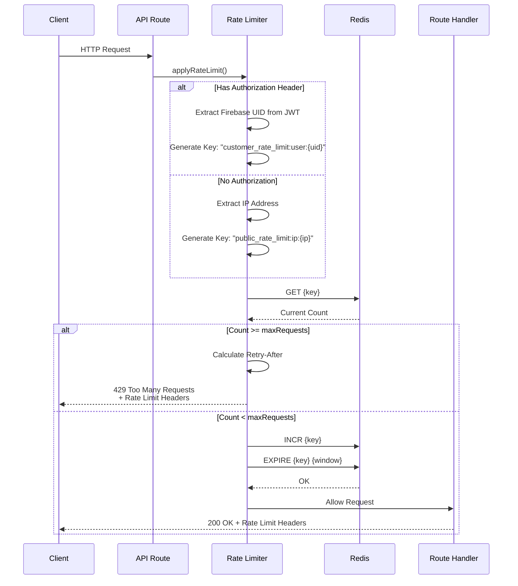

# API Architecture - Core Architecture

## Overview

RESTful API design using Next.js App Router with comprehensive multi-layer protection (CORS, rate limiting, CSRF, authentication).

**Key Features:**
- REST conventions (GET, POST, PUT, DELETE)
- Multi-layer protection middleware
- Rate limiting (Redis-backed)
- Authentication/authorization checks
- Standardized responses
- Pagination & filtering

---

## Table of Contents

1. [API Route Structure](#api-route-structure)
2. [Route Protection](#route-protection)
3. [Rate Limiting](#rate-limiting)
4. [HTTP Methods & Conventions](#http-methods--conventions)
5. [Request/Response Patterns](#requestresponse-patterns)
6. [Best Practices](#best-practices)

---

## API Route Structure

**Location:** `app/api/`

### Directory Organization

```
app/api/
├── admin/              # Admin-only endpoints
│   ├── customers/route.ts
│   ├── orders/route.ts
│   └── analytics/route.ts
├── customer/           # Customer endpoints
│   ├── profile/route.ts
│   └── orders/route.ts
├── public/             # Public endpoints (no auth)
│   └── system/route.ts
├── shared/             # Shared utilities
│   ├── contact-messages/route.ts
│   └── upload/route.ts
└── subscriptions/      # Subscription/payment
    ├── checkout/route.ts
    └── portal-link/route.ts
```

### Route File Template

```typescript
// app/api/resource/route.ts
import { NextRequest, NextResponse } from 'next/server';
import { withUserProtection } from '@/shared/middleware/api-route-protection';
import { requireAuth } from '@/features/auth/services/firebase-middleware';
import { createSuccessResponse, createBadRequestResponse } from '@/shared/utils/api/response-helpers';

async function getHandler(request: NextRequest) {
  // Verify authentication
  const authResult = await requireAuth(request);
  if (authResult instanceof NextResponse) return authResult;
  
  // Handle GET logic
  const data = await fetchData(authResult.user.id);
  
  return createSuccessResponse({ data });
}

async function postHandler(request: NextRequest) {
  const authResult = await requireAuth(request);
  if (authResult instanceof NextResponse) return authResult;
  
  const body = await request.json();
  
  // Validate input
  if (!body.requiredField) {
    return createBadRequestResponse('requiredField is required');
  }
  
  // Handle POST logic
  const created = await createResource(body);
  
  return createSuccessResponse({ data: created }, 201);
}

// Apply protection wrapper
export const GET = withUserProtection(getHandler, {
  rateLimitType: 'customer',
});

export const POST = withUserProtection(postHandler, {
  rateLimitType: 'customer',
});
```

---

## Route Protection

**Location:** `shared/middleware/api-route-protection.ts`

### Protection Wrapper

Comprehensive middleware that applies multiple security layers:

### API Request Flow


```typescript
export function withApiProtection(
  handler: RouteHandler,
  options: ProtectionOptions = {}
) {
  return async function protectedHandler(request, context) {
    // 1. CORS Validation
    const corsResponse = validateCORS(request);
    if (corsResponse) return corsResponse;

    // 2. Rate Limiting
    if (!options.skipRateLimit) {
      const rateLimitResponse = await applyRateLimiting(request, options.rateLimitType);
      if (rateLimitResponse) return rateLimitResponse;
    }

    // 3. CSRF Protection (authenticated endpoints only)
    if (!options.skipCSRF && ['POST', 'PUT', 'PATCH', 'DELETE'].includes(request.method)) {
      const csrfResponse = await validateCSRF(request, pathname);
      if (csrfResponse) return csrfResponse;
    }

    // 4. Authentication
    if (options.requireAuth) {
      const authResponse = await validateAuth(request, options.requireAuth);
      if (authResponse) return authResponse;
    }

    // 5. Execute handler
    const response = await handler(request, context);

    // 6. Add security headers
    return addSecurityHeaders(response);
  };
}
```

### Protection Options

```typescript
interface ProtectionOptions {
  skipRateLimit?: boolean;         // Skip rate limiting
  skipCSRF?: boolean;              // Skip CSRF (use for public endpoints)
  rateLimitType?: RateLimitType;   // Override rate limit type
  requireAuth?: 'user' | 'admin' | false;  // Auth requirement
}
```

### Convenience Wrappers

```typescript
// User endpoints (authenticated users)
export const withUserProtection = (handler, options = {}) => 
  withApiProtection(handler, {
    ...options,
    requireAuth: 'user',
    rateLimitType: options.rateLimitType || 'customer',
  });

// Admin endpoints (admin only)
export const withAdminProtection = (handler, options = {}) =>
  withApiProtection(handler, {
    ...options,
    requireAuth: 'admin',
    rateLimitType: 'admin',
  });

// Public endpoints (no auth, skip CSRF)
export const withPublicProtection = (handler, options = {}) =>
  withApiProtection(handler, {
    ...options,
    skipCSRF: true,
    rateLimitType: options.rateLimitType || 'public',
  });
```

### Usage Example

```typescript
// Admin endpoint
export const GET = withAdminProtection(async (request) => {
  // Only admins can access
  const data = await getAdminData();
  return NextResponse.json({ data });
});

// Customer endpoint
export const GET = withUserProtection(async (request) => {
  // Any authenticated user can access
  const data = await getUserData();
  return NextResponse.json({ data });
});

// Public endpoint
export const POST = withPublicProtection(async (request) => {
  // No auth required, CSRF skipped
  const body = await request.json();
  await handlePublicSubmission(body);
  return NextResponse.json({ success: true });
}, {
  rateLimitType: 'contact', // Strict rate limit for contact forms
});
```

---

## Rate Limiting

**Location:** `shared/services/rate-limit/comprehensive-rate-limiter.ts`, `shared/constants/rate-limit.config.ts`. IP and identity for rate-limit keys come from `shared/services/request-identity`.

### Rate Limit Configurations

```typescript
export const RATE_LIMIT_CONFIGS = {
  auth: {
    window: 60,        // 1 minute
    maxRequests: 5,    // 5 requests per minute
    keyPrefix: "auth_rate_limit",
    description: "Authentication endpoints",
  },
  payment: {
    window: 3600,      // 1 hour
    maxRequests: 30,   // 30 requests per hour
    keyPrefix: "payment_rate_limit",
    description: "Payment/checkout endpoints",
  },
  admin: {
    window: 60,
    maxRequests: 30,
    keyPrefix: "admin_rate_limit",
    description: "Admin operations",
  },
  customer: {
    window: 60,
    maxRequests: 60,
    keyPrefix: "customer_rate_limit",
    description: "Customer endpoints",
  },
  public: {
    window: 60,
    maxRequests: 500,
    keyPrefix: "public_rate_limit",
    description: "Public API endpoints",
  },
  contact: {
    window: 300,       // 5 minutes
    maxRequests: 5,    // 5 submissions per 5 minutes
    keyPrefix: "contact_rate_limit",
    description: "Contact form submissions",
  },
};
```

### How Rate Limiting Works



**Steps:**
1. Extract identifier:
   - If Authorization header → Extract Firebase UID from JWT token
   - If no auth → Use IP address
   
2. Generate Redis key: {keyPrefix}:{identifier}
   - Authenticated: "customer_rate_limit:user:{firebaseUID}"
   - Unauthenticated: "public_rate_limit:ip:{ipAddress}"
   
3. Check current count in Redis
4. If count >= maxRequests: Return 429 Too Many Requests
5. Increment count (with TTL = window)
6. Allow request

**Key Points:**
- **No session IDs:** Removed entirely
- **Authenticated users:** Rate limiting uses Firebase UID (stable across token refreshes)
- **Unauthenticated users:** Rate limiting uses IP address
- **Token caching:** Firebase token verification cached for 55 minutes

### Response Headers

```typescript
// Rate limit headers (automatically added)
X-RateLimit-Limit: 60        // Max requests allowed
X-RateLimit-Remaining: 42     // Requests remaining
X-RateLimit-Reset: 1641234567 // Unix timestamp when limit resets
Retry-After: 45               // Seconds to wait before retrying
```

### IP Blocking

IP resolution and blocking live in `shared/services/request-identity` (not rate-limit logic). For checking a request against a blocked-IP list:

```typescript
import { checkIpBlocking } from '@/shared/services/request-identity';

const { shouldBlock, reason, securityInfo } = checkIpBlocking(request, blockedIps);

if (shouldBlock) {
  return NextResponse.json(
    { error: 'Access denied' },
    { status: 403 }
  );
}
```

---

## HTTP Methods & Conventions

### Method Usage

| Method | Purpose | Request Body | Response Status | Idempotent |
|--------|---------|--------------|-----------------|------------|
| GET | Retrieve resources | No | 200 | Yes |
| POST | Create resource | Yes | 201 | No |
| PUT | Update/Replace | Yes | 200 | Yes |
| PATCH | Partial update | Yes | 200 | No |
| DELETE | Remove resource | No | 204 or 200 | Yes |

### Status Codes

```typescript
200 OK                  // Successful GET, PUT, PATCH, DELETE
201 Created             // Successful POST (resource created)
204 No Content          // Successful DELETE (no body)
400 Bad Request         // Invalid input
401 Unauthorized        // Missing/invalid token
403 Forbidden           // Insufficient permissions
404 Not Found           // Resource doesn't exist
422 Unprocessable Entity // Validation failed
429 Too Many Requests   // Rate limit exceeded
500 Internal Server Error // Server error
```

---

## Request/Response Patterns

### Standard Success Response

```typescript
import { createSuccessResponse } from '@/shared/utils/api/response-helpers';

// Single resource
return createSuccessResponse({
  user: { id: '123', name: 'John' }
});

// List with pagination
return createSuccessResponse({
  users: [...],
  pagination: {
    currentPage: 1,
    totalPages: 10,
    totalCount: 95,
    hasMore: true,
  }
});
```

### Standard Error Response

```typescript
import { createBadRequestResponse, createInternalErrorResponse } from '@/shared/utils/api/response-helpers';

// Bad request (400)
return createBadRequestResponse('Email is required');

// Validation error (422)
return createBadRequestResponse('Validation failed', zodError.issues);

// Internal error (500)
return createInternalErrorResponse('Failed to process request', error);
```

### Pagination Query Parameters

```
GET /api/resource?page=1&limit=20&search=query&sortBy=createdAt&sortOrder=desc

page: Page number (1-based, default: 1)
limit: Records per page (max: 100, default: 20)
search: Search term
sortBy: Sort field
sortOrder: 'asc' or 'desc'
```

### Response Format

```json
{
  "data": [...],
  "pagination": {
    "currentPage": 1,
    "totalPages": 5,
    "totalCount": 95,
    "limit": 20,
    "hasMore": true,
    "hasPrevious": false
  }
}
```

---

## Client-Side Fetch Utilities

**Location:** `shared/services/api/authenticated-fetch.ts`, `shared/services/api/safe-fetch.ts`, `shared/hooks/use-query-fetcher.ts`, `shared/lib/query-keys.ts`

### React Query (TanStack Query)

For GET requests with caching, use React Query:

- **useQuery + useQueryFetcher:** Cached GET requests with auth, CSRF, and timezone headers. Use `queryKeys` from `@/shared/lib/query-keys` for consistent keys and invalidation.
- **Invalidation:** After mutations, call `queryClient.invalidateQueries({ queryKey })` or with a predicate. On logout, all API caches are cleared via `queryClient.removeQueries({ predicate })` in app-context.
- **Provider:** `QueryProvider` in layout wraps the app; DevTools in development.

See [React Query Migration Guide](../../consider/react-query-migration-guide.md) for setup and patterns.

### Authenticated Fetch

For authenticated requests with automatic CSRF token handling:

```typescript
import { authenticatedFetch, authenticatedFetchJson } from '@/shared/services/api/authenticated-fetch';

// With automatic CSRF token for state-changing requests
const response = await authenticatedFetch('/api/customer/profile', {
  method: 'PUT',
  body: JSON.stringify({ name: 'John' }),
});

// JSON parsing with auto-unwrapping
const profile = await authenticatedFetchJson<UserProfile>('/api/customer/profile');
```

**Features:**
- ✅ Automatically includes Firebase JWT token in `Authorization` header
- ✅ Automatically adds CSRF token for POST/PUT/PATCH/DELETE requests
- ✅ Uses `safeFetch` internally (timeout, retry logic)
- ✅ Handles CSRF token invalidation and refresh
- ✅ Auto-unwraps standardized API responses (`{ data: ... }`)

### Public Fetch

For unauthenticated requests (no CSRF needed):

```typescript
import { publicFetch, publicFetchJson } from '@/shared/services/api/safe-fetch';

// Public endpoint (contact form, etc.)
const response = await publicFetch('/api/shared/contact-messages', {
  method: 'POST',
  body: JSON.stringify(formData),
});

// JSON parsing
const result = await publicFetchJson<ContactResponse>('/api/shared/contact-messages', {
  method: 'POST',
  body: JSON.stringify(formData),
});
```

**Features:**
- ✅ No authentication required
- ✅ No CSRF protection (not needed for public endpoints)
- ✅ Uses `safeFetch` internally (timeout, retry logic)
- ✅ Rate limiting uses IP address

### Safe Fetch

Base fetch utility with timeout and retry:

```typescript
import { safeFetch } from '@/shared/services/api/safe-fetch';

const response = await safeFetch(url, {
  method: 'POST',
  headers: { 'Content-Type': 'application/json' },
  body: JSON.stringify(data),
  timeout: 10000,        // 10 seconds
  retryAttempts: 2,     // Retry twice on failure
  retryOn: (error) => { // Custom retry logic
    return error.message.includes('network');
  },
});
```

**When to Use:**
- ✅ Use `authenticatedFetch` for authenticated API calls
- ✅ Use `publicFetch` for unauthenticated API calls
- ✅ Use `safeFetch` directly only for external APIs or special cases

---

## Best Practices

### Security

- ✅ Always use protection wrappers (withUserProtection, withAdminProtection)
- ✅ Verify authentication server-side (never trust client)
- ✅ Validate all inputs with Zod schemas
- ✅ Sanitize error messages (no sensitive data)
- ✅ Use rate limiting on all endpoints
- ✅ Apply CSRF protection to mutations (POST/PUT/DELETE) for authenticated endpoints only
- ✅ CSRF tokens bound to Firebase UID (encrypted with AES-256-GCM)
- ✅ Rate limiting uses Firebase UID for authenticated users, IP for unauthenticated
- ✅ Use `authenticatedFetch` for authenticated requests (automatic CSRF)
- ✅ Use `publicFetch` for unauthenticated requests

### Performance

- ✅ Use pagination for list endpoints
- ✅ Implement caching where appropriate
- ✅ Optimize database queries (use indexes, select only needed fields)
- ✅ Return only necessary data

### Error Handling

- ✅ Return appropriate status codes
- ✅ Use standardized error response format
- ✅ Log errors server-side with context
- ✅ Don't expose stack traces in production

### API Design

- ✅ Use RESTful conventions
- ✅ Version APIs if breaking changes expected
- ✅ Document endpoints clearly
- ✅ Keep responses consistent across endpoints

---

## Related Documentation

- [Authentication](./authentication.md) - Auth, roles, sessions
- [Security](./security.md) - CSRF, CORS, PII sanitization
- [Error Handling](./error-handling.md) - Error patterns and logging
- [Database](./database.md) - Database patterns and validation

---

*Last Updated: January 2026*
