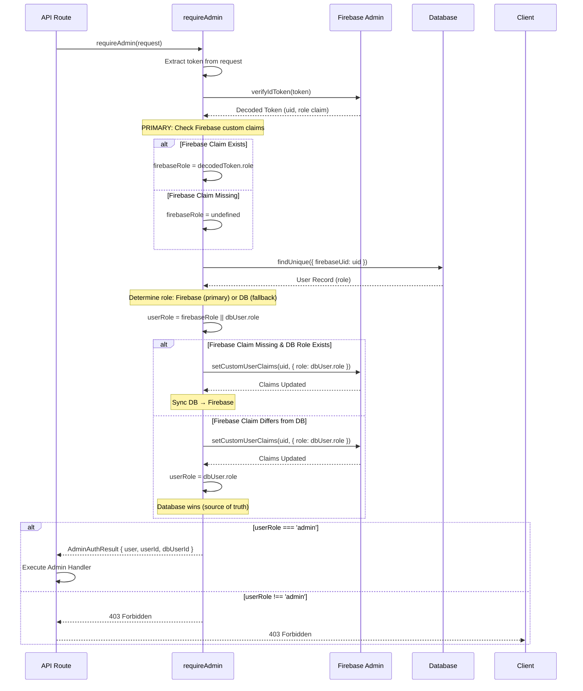
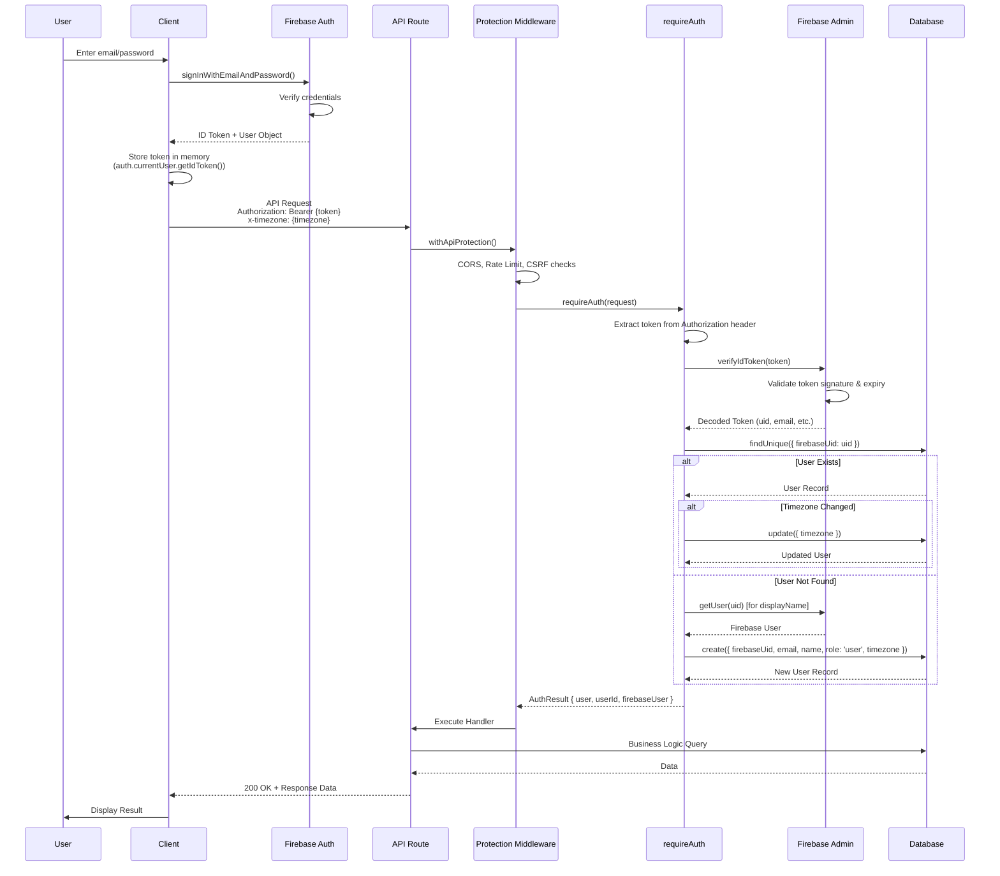
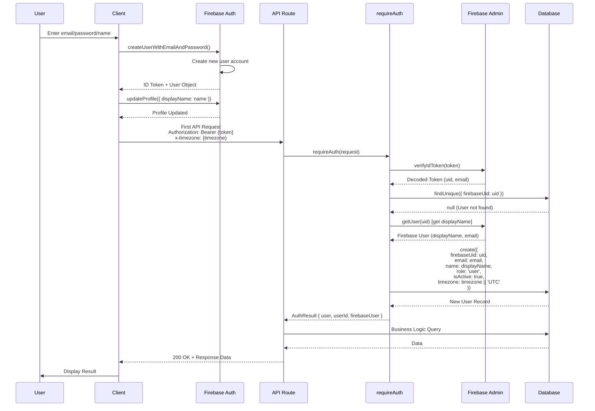
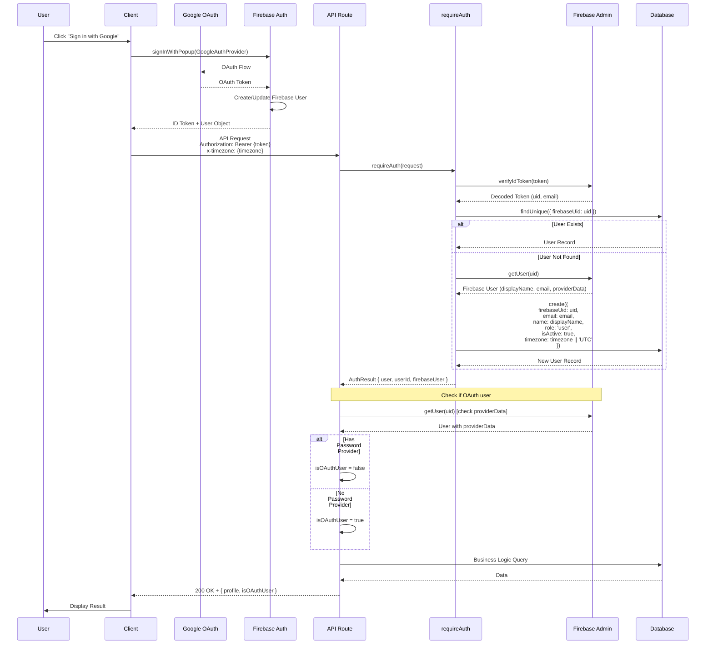

# Authentication & Authorization - Core Architecture

## Overview

Comprehensive Firebase Authentication with role-based access control, server-side verification, and session management.

**System Components:**
- **Client**: Firebase Auth SDK for authentication flows
- **Server**: Firebase Admin SDK for token verification
- **Database**: PostgreSQL for user data and roles (Prisma)
- **Session**: Managed by Firebase Auth SDK
- **Authorization**: Role-based access control (RBAC) with custom claims

---

## Table of Contents

1. [Architecture Overview](#architecture-overview)
2. [Client-Side Authentication](#client-side-authentication)
3. [Server-Side Verification](#server-side-verification)
4. [Role-Based Access Control](#role-based-access-control)
5. [Route Protection](#route-protection)
6. [Authentication Flows](#authentication-flows)
7. [Best Practices](#best-practices)

---

## Architecture Overview

```
┌─────────────────────────────────────────────────────────────┐
│                        Client Side                          │
├─────────────────────────────────────────────────────────────┤
│  Sign In/Up → AppProvider → AuthGuard → Protected UI  │
│  ↓                                                           │
│  ID Token (JWT) → Memory (auth.currentUser.getIdToken())    │
└────────────────────────┬────────────────────────────────────┘
                         │
                         │ Authorization: Bearer {token}
                         │
┌────────────────────────▼────────────────────────────────────┐
│                        Server Side                          │
├─────────────────────────────────────────────────────────────┤
│  API Route → withApiProtection → requireAuth() → Verify     │
│                ↓                    ↓                         │
│         Rate Limit/CSRF      Firebase Admin                  │
│         CORS/Validation      verifyIdToken()                 │
│                              ↓                               │
│                         PostgreSQL                           │
│                         (role, profile)                     │
└─────────────────────────────────────────────────────────────┘
```

---

## Client-Side Authentication

**Location:** `features/auth/`, `shared/services/firebase/`

### Firebase Configuration

```typescript
// shared/services/firebase/config.ts
import { initializeApp } from "firebase/app";
import { getAuth } from "firebase/auth";
import {
  FIREBASE_API_KEY,
  FIREBASE_AUTH_DOMAIN,
  FIREBASE_PROJECT_ID,
  // ... other config from envUtil
} from "@/shared/utils/config/envUtil";

const firebaseConfig = {
  apiKey: FIREBASE_API_KEY,
  authDomain: FIREBASE_AUTH_DOMAIN,
  projectId: FIREBASE_PROJECT_ID,
  // ... other config
};

export const app = initializeApp(firebaseConfig);
export const auth = getAuth(app);
```

### AppContext (useApp Hook)

**Location:** `shared/contexts/app-context.tsx`

The application uses a unified `AppProvider` that combines Firebase authentication with user profile data from the API. This provides a single source of truth for both auth state and user profile.

```typescript
// shared/contexts/app-context.tsx
'use client'

import { createContext, useContext } from 'react'
import { User } from 'firebase/auth'
import useSWR from 'swr'
import { useSWRFetcher } from '@/shared/hooks/use-swr-fetcher'

interface AppContextType {
  // Auth state
  user: User | null
  authLoading: boolean
  profile: UserProfile | null
  profileLoading: boolean
  profileError: string | null
  isOAuthUser: boolean
  
  // Auth methods
  signIn: (email: string, password: string) => Promise<void>
  signUp: (email: string, password: string, name?: string) => Promise<void>
  signInWithGoogle: () => Promise<void>
  logout: () => Promise<void>
  
  // Profile methods
  refreshProfile: () => Promise<void>
  updateProfile: (updates: Partial<UserProfile>) => Promise<void>
  
  // Computed
  isAuthenticated: boolean
  isAdmin: boolean
}

export const AppContext = createContext<AppContextType | undefined>(undefined)

export function useApp(): AppContextType {
  const context = useContext(AppContext)
  return context ?? defaultContext
}

// Usage in components
export function MyComponent() {
  const { user, profile, signIn, logout, isAdmin } = useApp()
  // ...
}
```

**Key Features:**
- Unified auth + profile state management
- SWR for profile data caching (5-minute cache, refresh interval)
- Automatic profile fetching when user is authenticated
- Profile update methods with cache invalidation
- Admin role checking from profile data
- OAuth user detection (`isOAuthUser` field)
- Timezone header handling for API requests
- Error state management (`profileError` field)

### Sign In Component

```typescript
'use client'

import { useState } from 'react'
import { useApp } from '@/shared/contexts/app-context'
import { useRouter } from 'next/navigation'

export function SignInForm() {
  const [email, setEmail] = useState('')
  const [password, setPassword] = useState('')
  const [error, setError] = useState('')
  const { signIn } = useApp()
  const router = useRouter()

  const handleSubmit = async (e: React.FormEvent) => {
    e.preventDefault()
    setError('')
    try {
      await signIn(email, password)
      router.push('/account') // Redirect after sign in
    } catch (err) {
      setError('Failed to sign in. Check your credentials.')
    }
  }

  return (
    <form onSubmit={handleSubmit}>
      <input type="email" value={email} onChange={(e) => setEmail(e.target.value)} />
      <input type="password" value={password} onChange={(e) => setPassword(e.target.value)} />
      {error && <p>{error}</p>}
      <button type="submit">Sign In</button>
    </form>
  )
}
```

---

## Server-Side Verification

**Location:** `features/auth/services/firebase-middleware.ts`

### Token Verification

```typescript
import { NextRequest, NextResponse } from 'next/server'
import { adminAuth } from '@/shared/services/firebase/admin'
import { prisma } from '@/shared/services/db/prisma'

/**
 * Requires authentication for API route
 * Verifies Firebase token and provisions user in database
 * Handles timezone detection and updates
 */
export async function requireAuth(
  request: NextRequest
): Promise<AuthResult | NextResponse> {
  // Extract token from Authorization header
  const authHeader = request.headers.get('Authorization')
  const token = authHeader?.replace('Bearer ', '') || null

  if (!token) {
    return NextResponse.json(
      { error: 'Authentication required' },
      { status: 401 }
    )
  }

  try {
    // Verify Firebase token
    const decodedToken = await adminAuth.verifyIdToken(token)
    
    // Detect user's timezone from headers
    const detectedTimezone = request.headers.get('x-timezone')

    // Get or create user in database using firebaseUid
    let dbUser = await prisma.user.findUnique({
      where: { firebaseUid: decodedToken.uid }
    })

    if (!dbUser) {
      // Get display name from Firebase user record
      let userName = 'User'
      try {
        const firebaseUser = await adminAuth.getUser(decodedToken.uid)
        userName = firebaseUser.displayName || decodedToken.name || 'User'
      } catch {
        userName = decodedToken.name || 'User'
      }

      // Auto-provision user
      dbUser = await prisma.user.create({
        data: {
          firebaseUid: decodedToken.uid,
          email: decodedToken.email || '',
          name: userName,
          role: 'user', // Default role
          isActive: true,
          timezone: detectedTimezone || 'UTC',
        }
      })
    } else if (detectedTimezone && dbUser.timezone !== detectedTimezone) {
      // Update timezone if detected and different
      dbUser = await prisma.user.update({
        where: { firebaseUid: decodedToken.uid },
        data: { timezone: detectedTimezone },
      })
    }

    // Return auth result
    return {
      firebaseUser: decodedToken,
      userId: decodedToken.uid, // Firebase UID
      user: dbUser, // Database user record
    }
  } catch (error) {
    // Handle specific error types
    if (
      error &&
      typeof error === 'object' &&
      'code' in error &&
      error.code === 'auth/id-token-expired'
    ) {
      return NextResponse.json({ error: 'Token expired' }, { status: 401 })
    }
    return NextResponse.json({ error: 'Invalid token' }, { status: 401 })
  }
}

/**
 * Requires admin role
 * 
 * ROLE DETERMINATION STRATEGY:
 * ============================
 * - Database is the SINGLE SOURCE OF TRUTH for role writes
 * - Firebase custom claims are used for READS (performance optimization)
 * - Flow: Database (write) -> Firebase (sync) -> Firebase (read)
 * 
 * When checking roles:
 * 1. PRIMARY: Read from Firebase custom claims (fast, no DB query)
 * 2. FALLBACK: If Firebase claim missing, read from database and sync to Firebase
 * 3. SYNC: If Firebase and database differ, database wins (sync DB -> Firebase)
 * 
 * This ensures:
 * - Fast reads (no DB query when Firebase claim exists)
 * - Database remains source of truth (users can't write to Firebase directly)
 * - Automatic sync keeps Firebase claims up-to-date
 */
export async function requireAdmin(
  request: NextRequest
): Promise<AdminAuthResultWithDbUserId | NextResponse> {
  // Extract token from Authorization header
  const authHeader = request.headers.get('Authorization')
  const token = authHeader?.replace('Bearer ', '') || null

  if (!token) {
    return NextResponse.json(
      { error: 'Authentication required' },
      { status: 401 }
    )
  }

  try {
    // Verify Firebase token
    const decodedToken = await adminAuth.verifyIdToken(token)
    
    // Detect user's timezone from headers
    const detectedTimezone = request.headers.get('x-timezone')

    // PRIMARY: Check Firebase custom claims first (fast, no DB query needed)
    const firebaseRole = decodedToken.role as string | undefined

    // Get database user (using same logic as requireAuth)
    // This includes auto-provisioning and timezone updates
    let dbUser = await prisma.user.findUnique({
      where: { firebaseUid: decodedToken.uid }
    })

    if (!dbUser) {
      // Auto-provision user (same logic as requireAuth)
      let userName = 'User'
      try {
        const firebaseUser = await adminAuth.getUser(decodedToken.uid)
        userName = firebaseUser.displayName || decodedToken.name || 'User'
      } catch {
        userName = decodedToken.name || 'User'
      }

      dbUser = await prisma.user.create({
        data: {
          firebaseUid: decodedToken.uid,
          email: decodedToken.email || '',
          name: userName,
          role: 'user',
          isActive: true,
          timezone: detectedTimezone || 'UTC',
        }
      })
    } else if (detectedTimezone && dbUser.timezone !== detectedTimezone) {
      dbUser = await prisma.user.update({
        where: { firebaseUid: decodedToken.uid },
        data: { timezone: detectedTimezone },
      })
    }

    // Determine user role: Firebase claim (primary) or database (fallback)
    let userRole = firebaseRole || dbUser.role

    // If Firebase claim is missing, sync database role to Firebase
    if (!firebaseRole && dbUser.role) {
      await adminAuth.setCustomUserClaims(decodedToken.uid, {
        role: dbUser.role,
      })
    }
    // If Firebase claim exists but differs from database, sync database to Firebase
    // (Database is source of truth, so database wins)
    else if (firebaseRole && dbUser.role && firebaseRole !== dbUser.role) {
      try {
        await adminAuth.setCustomUserClaims(decodedToken.uid, {
          role: dbUser.role,
        })
      } catch {
        // Sync failed; still use database role (source of truth)
      }
      userRole = dbUser.role // Always use database role
    }

    // Check if user has admin role
    if (userRole !== 'admin') {
      return NextResponse.json(
        { error: 'Admin access required' },
        { status: 403 }
      )
    }

    // Ensure firebaseUid is not null
    if (!dbUser.firebaseUid) {
      return NextResponse.json(
        { error: 'Invalid user data - missing Firebase UID' },
        { status: 500 }
      )
    }

    return {
      firebaseUser: decodedToken,
      userId: decodedToken.uid,
      user: dbUser,
      dbUserId: dbUser.id, // Database UUID
      staffId: dbUser.id, // Alias for availability/staff operations
    }
  } catch (error) {
    // Handle specific error types
    if (
      error &&
      typeof error === 'object' &&
      'code' in error &&
      error.code === 'auth/id-token-expired'
    ) {
      return NextResponse.json({ error: 'Token expired' }, { status: 401 })
    }
    return NextResponse.json({ error: 'Invalid token' }, { status: 401 })
  }
}
```

### Usage in API Routes

API routes should use the `withApiProtection` wrapper for comprehensive protection (rate limiting, CSRF, CORS, authentication). The wrapper automatically handles authentication checks.

```typescript
// app/api/customer/profile/route.ts
import { NextRequest, NextResponse } from 'next/server'
import { requireAuth } from '@/features/auth/services/firebase-middleware'
import { withUserProtection } from '@/shared/middleware/api-route-protection'
import { prisma } from '@/shared/services/db/prisma'
import { createSuccessResponse } from '@/shared/utils/api/response-helpers'

async function getHandler(request: NextRequest) {
  // requireAuth is called automatically by withUserProtection
  // But you can also call it directly if needed
  const authResult = await requireAuth(request)
  if (authResult instanceof NextResponse) {
    return authResult // Return 401 error
  }

  // authResult contains verified user
  // Note: authResult.user.id is the database UUID, not Firebase UID
  // authResult.userId is the Firebase UID
  const profile = await prisma.user.findUnique({
    where: { id: authResult.user.id }
  })

  return createSuccessResponse({ profile })
}

// Export with protection wrapper
export const GET = withUserProtection(getHandler, {
  rateLimitType: 'customer',
})
```

**Protection Wrappers Available:**
- `withUserProtection` - Requires user authentication
- `withAdminProtection` - Requires admin authentication
- `withPublicProtection` - Public routes with basic protection
- `withApiProtection` - Full control over protection options
- `withGetProtection` - GET routes (skips CSRF)
- `withMutationProtection` - POST/PUT/DELETE routes (full protection)

---

## Role-Based Access Control

### Role System

```typescript
type UserRole = 'user' | 'admin' | 'customer' | 'staff'

// Database model (Prisma schema)
model User {
  id          String   @id @default(uuid())  // UUID, NOT Firebase UID
  firebaseUid String?  @unique @map("firebase_uid")  // Firebase UID stored here
  email       String   @unique
  name        String
  role        String   @default("user")  // Source of truth for role writes
  isActive    Boolean  @default(true)
  isDeleted   Boolean  @default(false)
  timezone    String?  @default("UTC")
  phone       String?
  address     String?
  // ... other fields
}

// Firebase custom claim
interface CustomClaims {
  role?: string  // Synced from database for fast reads (performance optimization)
}
```

**Important:** The database `id` field is a UUID, not the Firebase UID. The Firebase UID is stored in the `firebaseUid` field. This separation allows for better database design and flexibility.

### Role Hierarchy

```
admin (highest privilege)
  ├─ Full system access
  ├─ Customer management
  ├─ Order management
  └─ Admin dashboard

user (standard)
  ├─ Own profile access
  ├─ Subscription management
  └─ Calculator access
```

### Setting Custom Claims

```typescript
// After role update in database
import { adminAuth } from '@/shared/services/firebase/admin'
import { prisma } from '@/shared/services/db/prisma'

// Always update database first (source of truth), then sync to Firebase
const user = await prisma.user.update({
  where: { firebaseUid: firebaseUid }, // Use firebaseUid, not id
  data: { role: 'admin' }
})

// Sync custom claim to Firebase (so token reads stay fast)
await adminAuth.setCustomUserClaims(firebaseUid, { role: 'admin' })

// User must refresh token to get new claims
// Client: await user.getIdToken(true)
```

**Note:** The `requireAdmin` function automatically syncs roles from database to Firebase custom claims when needed, so manual syncing is typically only needed when updating roles outside of the authentication flow.

### Role Sync Robustness (Avoiding Fragility)

To avoid a point-in-time where Firebase and the database disagree (e.g. user is admin in one and user in the other), the system enforces:

1. **Database-first ordering**  
   Whenever a role is written, update the **database first**, then sync to Firebase. That way we never have Firebase=admin and DB=user if the DB update fails. Implementations:
   - **Admin promote (PATCH /api/users):** DB update, then `FirebaseUserSync.syncUserUpdate()` (including role).
   - **Self-promote (POST /api/admin/verify):** DB upsert, then `setCustomUserClaims(uid, { role: 'admin' })`.

2. **Sync failure in requireAdmin**  
   If syncing DB → Firebase fails inside `requireAdmin`, we still **use the database role** for the authorization decision. The database is the source of truth; the next request may succeed in syncing to Firebase.

3. **Client token staleness**  
   After a role change, the client’s ID token still has the old claims until it refreshes (e.g. `user.getIdToken(true)` or the next AuthGuard check). Until then, the client may see the old role in token claims; server-side checks always use the DB (and sync) so authorization remains correct. Clients can call `refreshProfile()` and refresh the token after a role change to update UI (e.g. `isAdmin`) promptly.

### Server-Side Role Check

The `requireAdmin` function uses a sophisticated role determination strategy:



**Strategy:**
1. **Primary Check:** Reads from Firebase custom claims (fast, no DB query)
2. **Fallback:** If Firebase claim missing, reads from database and syncs to Firebase
3. **Sync:** If Firebase and database differ, database wins (syncs DB -> Firebase)

This ensures fast reads while maintaining database as the source of truth. See the [requireAdmin implementation](#token-verification) above for the full code.

### Client-Side Role Check

```typescript
'use client'

import { useApp } from '@/shared/contexts/app-context'

export function AdminDashboard() {
  const { isAdmin, authLoading } = useApp()

  if (authLoading) {
    return <div>Loading...</div>
  }

  if (!isAdmin) {
    return <div>Access Denied</div>
  }

  return <div>Admin Dashboard</div>
}
```

---

## Route Protection

### AuthGuard Component

The `AuthGuard` component automatically detects whether a route requires admin or user authentication based on the pathname, and handles verification accordingly.

```typescript
// features/auth/components/auth-guard.tsx
'use client'

import { useApp } from '@/shared/contexts/app-context'
import { useRouter, usePathname } from 'next/navigation'
import { useEffect, useState } from 'react'
import { useAuthenticatedFetch } from '@/features/auth/hooks/use-authenticated-fetch'

interface AuthGuardProps {
  children: React.ReactNode
  /** Force a specific auth type, otherwise auto-detects from pathname */
  authType?: 'admin' | 'user'
  /** List of public routes that don't require authentication */
  publicRoutes?: string[]
}

export function AuthGuard({
  children,
  authType,
  publicRoutes,
}: AuthGuardProps) {
  const { user, authLoading } = useApp()
  const router = useRouter()
  const pathname = usePathname()
  const { authenticatedFetch } = useAuthenticatedFetch()

  useEffect(() => {
    // Skip auth routes and public routes
    if (isAuthRoute(pathname) || isPublicRoute(pathname, publicRoutes)) {
      return
    }

    async function verifyAccess() {
      if (authLoading) return

      // User authentication check
      if (authType === 'user' || (!authType && pathname.startsWith('/(customer)'))) {
        if (!user) {
          const returnUrl = encodeURIComponent(window.location.href)
          router.push(`/sign-in?redirect_url=${returnUrl}`)
          return
        }
        // User is authenticated
        return
      }

      // Admin authentication check
      if (authType === 'admin' || (!authType && pathname.startsWith('/admin'))) {
        if (!user) {
          router.push('/sign-in')
          return
        }

        try {
          // Check Firebase custom claims first (no API call needed)
          const tokenResult = await user.getIdTokenResult(true) // Force refresh

          if (tokenResult.claims.role === 'admin') {
            // Admin verified via custom claims
            return
          }

          // Fallback: Verify via API
          const response = await authenticatedFetch('/api/admin/verify')
          if (!response.ok) {
            router.push('/')
            return
          }
          // Force token refresh to get updated claims
          await user.getIdToken(true)
        } catch (error) {
          router.push('/')
        }
      }
    }

    verifyAccess()
  }, [user, authLoading, router, pathname, authType, publicRoutes, authenticatedFetch])

  if (authLoading) {
    return <div>Loading...</div>
  }

  return <>{children}</>
}
```

**Key Features:**
- Auto-detects admin vs user routes from pathname
- Checks Firebase custom claims first (fast, no API call)
- Falls back to API verification if needed
- Supports public routes
- Handles redirect URLs for user routes

### Prefer layout-level wrapping (DRY)

**Always wrap at the layout level** so all child routes are protected in one place. Do not repeat `isAdmin` / `authLoading` / "Access Denied" / "Loading..." in individual pages or components.

- **Admin:** `app/admin/layout.tsx` wraps with `<AuthGuard authType="admin">`. Any page under `/admin/*` is already protected; child components should not check `isAdmin` or `authLoading` for access control.
- **Customer:** `app/(customer)/(main)/layout.tsx` wraps with `<AuthGuard authType="user">`. Child pages/components can assume the user is authenticated.

If a component needs to show different UI based on role (e.g. a nav link that only appears for admins), use `useApp().isAdmin` for that UI only—not for guarding the whole page.

### Usage in layouts (recommended)

```typescript
// app/admin/layout.tsx
import { AuthGuard } from '@/features/auth/components/auth-guard'

export default function AdminLayout({ children }) {
  return (
    <AuthGuard authType="admin">
      <DashboardLayout>{children}</DashboardLayout>
    </AuthGuard>
  )
}
```

```typescript
// app/(customer)/(main)/layout.tsx
import { AuthGuard } from '@/features/auth/components/auth-guard'

export default function MainLayout({ children }) {
  return (
    <AuthGuard authType="user">
      {children}
    </AuthGuard>
  )
}
```

---

## Authentication Flows

### Sign In Flow



**Steps:**
1. User enters email/password
2. Client: signInWithEmailAndPassword()
3. Firebase: returns ID token
4. Client: stores token in memory (via auth.currentUser.getIdToken())
5. Client: sends API request with token in Authorization header + x-timezone header
6. Server: withApiProtection wrapper applies rate limiting, CSRF, CORS checks
7. Server: requireAuth() verifies token with Firebase Admin
8. Server: gets/creates user in database using firebaseUid
9. Server: updates timezone if detected from header
10. Server: returns response

### Sign Up Flow



**Steps:**
1. User enters email/password/name
2. Client: createUserWithEmailAndPassword()
3. Firebase: creates user, returns ID token
4. Client: updateProfile() with name
5. Client: sends first API request with x-timezone header
6. Server: requireAuth() verifies token
7. Server: auto-provisions user in database with 'user' role
   - Creates user with firebaseUid, email, name, timezone
   - Sets isActive: true
8. Server: returns response

### Google Sign-In Flow



**Steps:**
1. User clicks "Sign in with Google"
2. Client: signInWithPopup(GoogleAuthProvider)
3. Firebase: OAuth flow, returns ID token
4. Client: sends API request with x-timezone header
5. Server: requireAuth() verifies token
6. Server: auto-provisions user with Google email/name
7. Server: detects OAuth user (isOAuthUser: true in profile response)
8. Server: returns response with profile and isOAuthUser flag

**OAuth User Detection:**
- OAuth users are detected by checking Firebase provider data
- OAuth users cannot change their email (handled in profile update endpoint)
- `isOAuthUser` flag is included in profile API responses

### Token Refresh

```
Client: user.getIdToken(true) // Force refresh
  ↓
Firebase: issues new token with latest claims (including role)
  ↓
Client: uses new token for subsequent requests
```

**When to Refresh:**
- After role changes (admin verification in AuthGuard)
- When custom claims are updated
- Periodically to ensure claims are up-to-date
- Before sensitive operations requiring latest permissions

---

## Best Practices

### Security

- ✅ Always verify tokens server-side (never trust client)
- ✅ Store tokens in memory, not localStorage (XSS protection)
- ✅ CSRF tokens bound to Firebase UID (encrypted with AES-256-GCM)
- ✅ Validate user roles server-side (don't rely on client checks)
- ✅ Use Firebase Admin SDK only server-side (never expose service account)
- ✅ No custom session IDs (Firebase handles sessions)

### Performance

- ✅ Use custom claims for role checks (avoid database queries)
- ✅ Cache user data with appropriate TTL (5-minute SWR cache)
- ✅ Auto-provision users on first API request
- ✅ Use onAuthStateChanged for real-time auth state
- ✅ Read roles from Firebase claims first, fallback to database
- ✅ Automatic role sync keeps Firebase claims up-to-date

### Error Handling

- ✅ Return 401 for missing/invalid tokens
- ✅ Return 403 for insufficient permissions
- ✅ Handle specific error types (token expired, invalid token, etc.)
- ✅ Log authentication errors server-side with debug logging
- ✅ Show user-friendly error messages client-side
- ✅ Handle OAuth provider errors gracefully
- ✅ Distinguish between authentication and authorization errors

### User Experience

- ✅ Show loading state during auth check
- ✅ Redirect to sign-in if not authenticated
- ✅ Preserve intended destination after sign-in (redirect_url parameter)
- ✅ Handle OAuth provider errors gracefully
- ✅ Automatic timezone detection and updates
- ✅ Clear error messages for different failure scenarios
- ✅ Support for public routes that don't require authentication

---

## Additional Features

### Timezone Detection

The system automatically detects and updates user timezones:

- Client sends `x-timezone` header with API requests
- Server detects timezone in `requireAuth()` and `requireAdmin()`
- User timezone is updated in database if different
- Timezone is set during user auto-provisioning

### OAuth User Detection

OAuth users are automatically detected:

- Profile API returns `isOAuthUser` flag
- OAuth users cannot change email (enforced in profile update)
- Provider information is checked from Firebase user record

### Return Types

**AuthResult:**
```typescript
{
  firebaseUser: FirebaseDecodedToken  // Decoded Firebase token
  userId: string                      // Firebase UID
  user: DatabaseUser                  // Database user record (id is UUID)
}
```

**AdminAuthResultWithDbUserId:**
```typescript
{
  firebaseUser: FirebaseDecodedToken
  userId: string                      // Firebase UID
  user: DatabaseUser                  // Database user record
  dbUserId: string                    // Database UUID (same as user.id)
  staffId: string                    // Alias for dbUserId
}
```

**Important:** `userId` is the Firebase UID, while `user.id` and `dbUserId` are database UUIDs. Use `firebaseUid` field to query by Firebase UID.

---

## Related Documentation

- [Security](./security.md) - CSRF, CORS, rate limiting, PII sanitization
- [API Architecture](./api.md) - API routes, protection, error handling
- [Error Handling](./error-handling.md) - Error patterns and logging

---

*Last Updated: January 2026*
