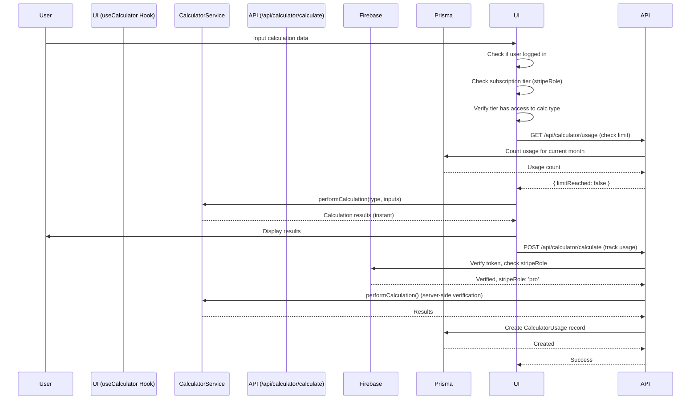

# Calculator System - Domain Architecture

**Template context:** This doc describes the **default core-feature implementation** (calculators). To build a different product (e.g. document tools), replace this module and config; see [Template roadmap](../../template-roadmap.md) and [Where to start coding](../../where-to-start-coding.md).

## Overview

The Calculator System is the default core feature of the template, providing financial calculation capabilities including mortgage, loan, investment, and retirement planning. The system integrates subscription-based access control, usage tracking, and comprehensive result visualization.

**Key Components:**
- **Calculator Constants:** Centralized configuration for all calculators (`calculator.constants.ts`)
- **CalculatorService:** Pure calculation logic (mortgage, loan, investment, retirement) with type-safe function overloads
- **Input Validation:** Zod schemas for runtime validation of all calculator inputs
- **Type Guards:** Type-safe utilities for SubscriptionTier validation
- **useCalculator Hook:** React hook for client-side calculations with subscription validation
- **API Route:** Server-side calculation endpoint with authentication, validation, and usage tracking
- **Calculator Components:** UI components for each calculator type (dynamically mapped)
- **Usage Tracking:** Monthly calculation limits based on subscription tier

---

## Table of Contents

1. [Calculator Configuration](#calculator-configuration)
2. [Calculator Types](#calculator-types)
3. [Input Validation](#input-validation)
4. [Type Safety & Type Guards](#type-safety--type-guards)
5. [Calculation Service](#calculation-service)
6. [Client-Side Hook](#client-side-hook)
7. [API Endpoint](#api-endpoint)
8. [Access Control & Usage Limits](#access-control--usage-limits)
9. [Real Implementation Examples](#real-implementation-examples)
10. [Data Flow](#data-flow)
11. [Adding New Calculators](#adding-new-calculators)

---

## Calculator Configuration

### Centralized Calculator Constants

**Location:** `project/features/calculator/constants/calculator.constants.ts`

All calculator metadata, tier requirements, and UI configuration is centralized in a single configuration object. This makes it easy to add new calculators by simply adding an entry to the config.

**Design Pattern:** Configuration-Driven Architecture
- Single source of truth for all calculator metadata
- Type-safe with TypeScript inference
- Easy to extend - just add to `CALCULATOR_CONFIG`
- Used by both frontend and backend

### Calculator Configuration Structure

```typescript
export const CALCULATOR_CONFIG = {
  mortgage: {
    id: 'mortgage' as const,
    name: 'Mortgage Calculator',
    shortName: 'Mortgage',
    description: 'Calculate monthly mortgage payments and amortization schedules',
    longDescription: 'Calculate monthly mortgage payments, total interest, and complete amortization schedules...',
    tierRequirement: null, // FREE - no subscription required
    icon: Home,
    displayOrder: 1,
    features: [
      'Principal and interest calculations',
      'Property tax and insurance estimates',
      // ...
    ],
    availableIn: ['basic', 'pro', 'enterprise'] as const,
    mobileLabel: 'Home',
  },
  loan: {
    id: 'loan' as const,
    name: 'Loan Calculator',
    // ... similar structure
    tierRequirement: 'basic' as SubscriptionTier,
    // ...
  },
  // ... other calculators
} as const;
```

**Key Benefits:**
- ✅ **Single source of truth** - All calculator metadata in one place
- ✅ **Type safety** - TypeScript infers types from config
- ✅ **Easy to extend** - Add new calculator by adding config entry
- ✅ **Consistent** - Same metadata used everywhere (API, UI, permissions)

### Derived Types and Constants

```typescript
// Type derived from config keys
export type CalculationType = keyof typeof CALCULATOR_CONFIG;

// Valid types array (derived from config)
export const VALID_CALCULATION_TYPES: readonly CalculationType[] = 
  Object.keys(CALCULATOR_CONFIG) as CalculationType[];

// Tier requirements (derived from config)
export const CALCULATOR_TIER_REQUIREMENTS = Object.fromEntries(
  Object.entries(CALCULATOR_CONFIG).map(([key, config]) => [
    key,
    config.tierRequirement,
  ])
) as Record<CalculationType, SubscriptionTier | null>;
```

### Helper Functions

```typescript
// Get calculator configuration
getCalculatorConfig(type: CalculationType): CalculatorMetadata

// Get all calculators (sorted by displayOrder)
getAllCalculatorConfigs(): CalculatorMetadata[]

// Get calculator name/description/icon
getCalculatorName(type: CalculationType): string
getCalculatorShortName(type: CalculationType): string
getCalculatorDescription(type: CalculationType): string
getCalculatorIcon(type: CalculationType): LucideIcon

// Get calculators for a tier
getCalculatorsForTier(tier: SubscriptionTier): CalculationType[]

// Check if calculator is free
isCalculatorFree(type: CalculationType): boolean
```

---

## Calculator Types

### Supported Calculators

Calculator types are now derived from the centralized configuration:

```typescript
// Type is automatically inferred from CALCULATOR_CONFIG keys
export type CalculationType = keyof typeof CALCULATOR_CONFIG;
// Result: 'mortgage' | 'loan' | 'investment' | 'retirement'

// Valid types array is automatically generated
export const VALID_CALCULATION_TYPES: readonly CalculationType[] = 
  Object.keys(CALCULATOR_CONFIG) as CalculationType[];
```

### Mortgage Calculator

**Inputs:**

```typescript
interface MortgageInputs {
  loanAmount: number;           // Total loan amount
  interestRate: number;         // Annual percentage rate
  loanTerm: number;             // Years
  downPayment?: number;         // Optional down payment
  propertyTax?: number;         // Annual property tax
  homeInsurance?: number;       // Annual home insurance
  pmi?: number;                 // Private Mortgage Insurance (annual)
}
```

**Results:**

```typescript
interface MortgageResult {
  monthlyPayment: number;                      // Total monthly payment
  totalPayment: number;                        // Total paid over life of loan
  totalInterest: number;                       // Total interest paid
  monthlyPrincipalAndInterest: number;         // P&I portion
  monthlyTaxesAndInsurance?: number;           // Taxes + Insurance portion
  amortizationSchedule?: AmortizationScheduleEntry[]; // Full schedule
}
```

**Calculation Formula:**

```typescript
// Monthly payment calculation
const principal = loanAmount - downPayment;
const monthlyRate = interestRate / 100 / 12;
const numPayments = loanTerm * 12;

const monthlyPrincipalAndInterest = principal *
  (monthlyRate * Math.pow(1 + monthlyRate, numPayments)) /
  (Math.pow(1 + monthlyRate, numPayments) - 1);

const monthlyTaxesAndInsurance = (propertyTax + homeInsurance + pmi) / 12;
const monthlyPayment = monthlyPrincipalAndInterest + monthlyTaxesAndInsurance;
```

### Loan Calculator

**Inputs:**

```typescript
interface LoanInputs {
  principal: number;      // Loan amount
  interestRate: number;   // Annual percentage rate
  term: number;           // Months
}
```

**Results:**

```typescript
interface LoanResult {
  monthlyPayment: number;
  totalPayment: number;
  totalInterest: number;
  amortizationSchedule?: AmortizationScheduleEntry[];
}
```

### Investment Calculator

**Inputs:**

```typescript
interface InvestmentInputs {
  initialInvestment: number;
  monthlyContribution?: number;
  annualInterestRate: number;       // Percentage
  years: number;
  compoundFrequency?: number;       // Default: 12 (monthly)
}
```

**Results:**

```typescript
interface InvestmentResult {
  futureValue: number;              // Total value at end
  totalContributions: number;       // Sum of all contributions
  totalInterest: number;            // Interest earned
  growthChart?: InvestmentGrowthEntry[]; // Yearly growth data
}
```

**Calculation Formula:**

```typescript
// Future value of initial investment
const futureValueOfInitial = initialInvestment *
  Math.pow(1 + monthlyRate, totalPeriods);

// Future value of monthly contributions
const futureValueOfContributions = monthlyContribution *
  ((Math.pow(1 + monthlyRate, totalPeriods) - 1) / monthlyRate);

const futureValue = futureValueOfInitial + futureValueOfContributions;
```

### Retirement Calculator

**Inputs:**

```typescript
interface RetirementInputs {
  currentAge: number;
  retirementAge: number;
  currentSavings: number;
  monthlyContribution: number;
  annualReturnRate: number;              // Percentage
  expectedRetirementSpending: number;    // Monthly
  lifeExpectancy?: number;               // Default: 85
}
```

**Results:**

```typescript
interface RetirementResult {
  retirementSavings: number;          // Total savings at retirement
  yearsInRetirement: number;          // Years of retirement
  monthlyRetirementIncome: number;    // Safe monthly withdrawal
  isOnTrack: boolean;                 // Meeting retirement goals?
  shortfall?: number;                 // Amount short (if not on track)
  surplus?: number;                   // Amount over (if on track)
  recommendations?: string[];         // Personalized recommendations
}
```

**Calculation Logic:**

```typescript
// Calculate savings at retirement
const yearsToRetirement = retirementAge - currentAge;
const monthlyRate = annualReturnRate / 100 / 12;
const totalMonths = yearsToRetirement * 12;

const futureValueOfCurrentSavings = currentSavings *
  Math.pow(1 + monthlyRate, totalMonths);

const futureValueOfContributions = monthlyContribution *
  ((Math.pow(1 + monthlyRate, totalMonths) - 1) / monthlyRate);

const retirementSavings = futureValueOfCurrentSavings + futureValueOfContributions;

// Apply 4% safe withdrawal rule
const safeWithdrawalRate = 0.04;
const requiredSavings = (expectedRetirementSpending * 12) / safeWithdrawalRate;

const isOnTrack = retirementSavings >= requiredSavings;
```

---

## Input Validation

### Zod Validation Schemas

**Location:** `project/features/calculator/types/calculator-validation.ts`

All calculator inputs are validated at the API boundary using Zod schemas. This provides:
- **Runtime type safety** - Validates data structure and types
- **Business rule validation** - Enforces constraints (e.g., interest rates 0-100%, ages 18-100)
- **Cross-field validation** - Validates relationships between fields (e.g., retirement age > current age)
- **Type inference** - TypeScript types automatically inferred from schemas

### Validation Schemas

```typescript
import { z } from 'zod';

/**
 * Mortgage Calculator Input Schema
 * Includes business rules: downPayment < loanAmount
 */
export const mortgageInputSchema = z.object({
  loanAmount: z.number().positive().min(1),
  interestRate: z.number().min(0).max(100),
  loanTerm: z.number().int().positive().min(1).max(50),
  downPayment: z.number().nonnegative().optional(),
  propertyTax: z.number().nonnegative().optional(),
  homeInsurance: z.number().nonnegative().optional(),
  pmi: z.number().nonnegative().optional(),
}).refine(
  (data) => !data.downPayment || data.downPayment < data.loanAmount,
  { message: 'Down payment must be less than loan amount', path: ['downPayment'] }
);

/**
 * Loan Calculator Input Schema
 */
export const loanInputSchema = z.object({
  principal: z.number().positive().min(1),
  interestRate: z.number().min(0).max(100),
  term: z.number().int().positive().min(1).max(600),
});

/**
 * Investment Calculator Input Schema
 */
export const investmentInputSchema = z.object({
  initialInvestment: z.number().nonnegative(),
  monthlyContribution: z.number().nonnegative().optional(),
  annualInterestRate: z.number().min(0).max(100),
  years: z.number().int().positive().min(1).max(100),
  compoundFrequency: z.number().int().min(1).max(365).optional(),
});

/**
 * Retirement Calculator Input Schema
 * Includes cross-field validation: retirementAge > currentAge
 */
export const retirementInputSchema = z.object({
  currentAge: z.number().int().positive().min(18).max(100),
  retirementAge: z.number().int().positive().min(18).max(100),
  currentSavings: z.number().nonnegative(),
  monthlyContribution: z.number().nonnegative(),
  annualReturnRate: z.number().min(0).max(100),
  expectedRetirementSpending: z.number().positive().min(1),
  lifeExpectancy: z.number().int().positive().min(50).max(120).optional(),
}).refine(
  (data) => data.retirementAge > data.currentAge,
  { message: 'Retirement age must be greater than current age', path: ['retirementAge'] }
);
```

### Validation Function

```typescript
/**
 * Type-safe validation function
 */
export function validateCalculatorInput<T extends z.ZodTypeAny>(
  schema: T,
  input: unknown
): { success: true; data: z.infer<T> } | { success: false; error: string; details: z.ZodError['errors'] } {
  const result = schema.safeParse(input);
  
  if (result.success) {
    return { success: true, data: result.data };
  }
  
  return {
    success: false,
    error: result.error.errors.map(e => `${e.path.join('.')}: ${e.message}`).join(', '),
    details: result.error.errors,
  };
}
```

### Usage in API Route

```typescript
// Validate inputs based on calculation type
switch (calculationType) {
  case 'mortgage': {
    const validation = validateCalculatorInput(mortgageInputSchema, inputs);
    if (!validation.success) {
      return NextResponse.json(
        { error: 'Invalid mortgage inputs', details: validation.details },
        { status: 422 }
      );
    }
    validatedInputs = validation.data; // Type-safe: MortgageInputs
    break;
  }
  // ... other cases
}
```

**Benefits:**
- ✅ **Type safety** - Validated inputs are guaranteed to match expected types
- ✅ **Clear error messages** - Field-level validation errors with specific messages
- ✅ **Business rules enforced** - Invalid combinations caught at API boundary
- ✅ **No "any" types** - Full type safety throughout the stack

---

## Type Safety & Type Guards

### SubscriptionTier Type Guards

**Location:** `project/shared/utils/type-guards/subscription-type-guards.ts`

Instead of unsafe type assertions (`as any`), we use type guards for runtime validation:

```typescript
import { SUBSCRIPTION_TIERS, SubscriptionTier } from '@/shared/constants/subscription.constants';

/**
 * Type guard to check if a value is a valid SubscriptionTier
 */
export function isSubscriptionTier(value: unknown): value is SubscriptionTier {
  if (typeof value !== 'string') {
    return false;
  }
  return Object.values(SUBSCRIPTION_TIERS).includes(value as SubscriptionTier);
}

/**
 * Safely narrows a value to SubscriptionTier or returns null
 */
export function toSubscriptionTier(value: unknown): SubscriptionTier | null {
  return isSubscriptionTier(value) ? value : null;
}

/**
 * Validates and narrows a value to SubscriptionTier, throwing if invalid
 */
export function assertSubscriptionTier(
  value: unknown,
  context = 'subscription tier validation'
): SubscriptionTier {
  if (!isSubscriptionTier(value)) {
    throw new Error(
      `Invalid ${context}: expected one of ${Object.values(SUBSCRIPTION_TIERS).join(', ')}, got ${typeof value === 'string' ? value : String(value)}`
    );
  }
  return value;
}
```

### Usage Pattern

**Before (Unsafe):**
```typescript
const stripeRole = authResult.firebaseUser.stripeRole as SubscriptionTier | null | undefined;
if (stripeRole && Object.values(SUBSCRIPTION_TIERS).includes(stripeRole as any)) {
  const tierConfig = getTierConfig(stripeRole as any);
}
```

**After (Type-Safe):**
```typescript
// Use type guard instead of unsafe type assertion
const stripeRole = toSubscriptionTier(authResult.firebaseUser.stripeRole);

if (stripeRole) {
  const tierConfig = getTierConfig(stripeRole); // Type-safe, no "as any"
}
```

**Benefits:**
- ✅ **Runtime validation** - Catches invalid tier values at runtime
- ✅ **Type safety** - TypeScript narrows types correctly
- ✅ **No "any" types** - Eliminates unsafe type assertions
- ✅ **Better error messages** - Clear errors when validation fails

---

## Calculation Service

### CalculatorService Class

**Location:** `project/features/calculator/services/calculator-service.ts`

```typescript
export class CalculatorService {
  /**
   * Calculate mortgage payment
   */
  static calculateMortgage(inputs: MortgageInputs): MortgageResult {
    const startTime = Date.now();

    try {
      const { loanAmount, interestRate, loanTerm, downPayment = 0, propertyTax = 0, homeInsurance = 0, pmi = 0 } = inputs;

      const principal = loanAmount - downPayment;
      const monthlyRate = interestRate / 100 / 12;
      const numPayments = loanTerm * 12;

      // Calculate monthly principal and interest
      const monthlyPrincipalAndInterest = principal *
        (monthlyRate * Math.pow(1 + monthlyRate, numPayments)) /
        (Math.pow(1 + monthlyRate, numPayments) - 1);

      const monthlyTaxesAndInsurance = (propertyTax + homeInsurance + pmi) / 12;
      const monthlyPayment = monthlyPrincipalAndInterest + monthlyTaxesAndInsurance;

      const totalPayment = monthlyPayment * numPayments;
      const totalInterest = totalPayment - principal;

      // Generate amortization schedule
      const amortizationSchedule = this.generateMortgageAmortizationSchedule(
        principal,
        monthlyRate,
        numPayments,
        monthlyPrincipalAndInterest
      );

      const calculationTime = Date.now() - startTime;

      debugLog.info('Mortgage calculation completed', {
        service: 'calculator-service',
        operation: 'calculateMortgage',
      }, {
        calculationTime: `${calculationTime}ms`,
      });

      return {
        monthlyPayment: Math.round(monthlyPayment * 100) / 100,
        totalPayment: Math.round(totalPayment * 100) / 100,
        totalInterest: Math.round(totalInterest * 100) / 100,
        monthlyPrincipalAndInterest: Math.round(monthlyPrincipalAndInterest * 100) / 100,
        monthlyTaxesAndInsurance: Math.round(monthlyTaxesAndInsurance * 100) / 100,
        amortizationSchedule,
      };
    } catch (error) {
      debugLog.error('Error calculating mortgage', {
        service: 'calculator-service',
        operation: 'calculateMortgage',
      }, error);
      throw new Error('Failed to calculate mortgage payment');
    }
  }

  /**
   * Perform calculation based on type
   * Uses function overloads for type safety
   */
  static performCalculation(type: 'mortgage', inputs: MortgageInputs): CalculationResponse;
  static performCalculation(type: 'loan', inputs: LoanInputs): CalculationResponse;
  static performCalculation(type: 'investment', inputs: InvestmentInputs): CalculationResponse;
  static performCalculation(type: 'retirement', inputs: RetirementInputs): CalculationResponse;
  static performCalculation(
    type: CalculationType,
    inputs: MortgageInputs | LoanInputs | InvestmentInputs | RetirementInputs
  ): CalculationResponse {
    const startTime = Date.now();
    let results: MortgageResult | LoanResult | InvestmentResult | RetirementResult;

    switch (type) {
      case 'mortgage':
        // Type narrowing: TypeScript knows inputs is MortgageInputs when type is 'mortgage'
        // This is safe because the API layer validates inputs before calling this method
        results = this.calculateMortgage(inputs as MortgageInputs);
        break;
      case 'loan':
        results = this.calculateLoan(inputs as LoanInputs);
        break;
      case 'investment':
        results = this.calculateInvestment(inputs as InvestmentInputs);
        break;
      case 'retirement':
        results = this.calculateRetirement(inputs as RetirementInputs);
        break;
      default: {
        // Exhaustiveness check - TypeScript will error if we miss a case
        const _exhaustive: never = type;
        throw new Error(`Unsupported calculation type: ${_exhaustive}`);
      }
    }

    return {
      type,
      inputs: inputs as unknown as Record<string, unknown>,
      results,
      calculationTime: Date.now() - startTime,
    };
  }
```

**Type Safety Improvements:**
- ✅ **Function overloads** - TypeScript narrows input types based on calculation type
- ✅ **Exhaustiveness checking** - TypeScript errors if a case is missed
- ✅ **Better IDE support** - Autocomplete and type checking work correctly
}
```

---

## Client-Side Hook

### useCalculator Hook

**Location:** `project/features/calculator/hooks/use-calculator.ts`

```typescript
export function useCalculator(): UseCalculatorResult {
  const { user } = useApp();
  const { role, isLoading: subscriptionLoading } = useSubscription();
  const [isLoading, setIsLoading] = useState(false);
  const [error, setError] = useState<string | null>(null);
  const [usageStats, setUsageStats] = useState<UsageStats | null>(null);

  const calculate = useCallback(
    async (type: CalculationType, inputs: CalculatorInputs): Promise<CalculationResponse | null> => {
      if (!user) {
        setError('You must be logged in to use the calculator');
        return null;
      }

      setIsLoading(true);
      setError(null);

      try {
        // Check subscription access
        if (!role) {
          setError('You need an active subscription to use the calculator');
          setIsLoading(false);
          return null;
        }

        // Check calculator access using centralized permission system
        if (!hasCalculatorAccess(role, type)) {
          setError(`This calculation type is not available in your ${role} plan. Please upgrade.`);
          setIsLoading(false);
          return null;
        }

        // Check usage limit via API
        const limitCheck = await authenticatedFetchJson<{ limitReached: boolean }>('/api/calculator/usage');
        if (limitCheck?.limitReached) {
          setError('You have reached your monthly calculation limit. Please upgrade your plan.');
          setIsLoading(false);
          return null;
        }

        // Perform calculation via API (single source of truth)
        // API handles validation, permission checks, and usage tracking
        const result = await authenticatedFetchJson<CalculationResponse>('/api/calculator/calculate', {
          method: 'POST',
          body: JSON.stringify({ type, inputs }),
        });

        if (!result) {
          setError('Failed to perform calculation');
          setIsLoading(false);
          return null;
        }

        setIsLoading(false);
        return result;
      } catch (err) {
        const errorMessage = err instanceof Error ? err.message : 'An error occurred';
        setError(errorMessage);
        setIsLoading(false);
        return null;
      }
    },
    [user, role]
  );

  return {
    calculate,
    isLoading,
    error,
    canUseCalculator: user !== null,
    usageLimitReached: usageStats?.percentageUsed === 100,
    usageStats,
  };
}
```

---

## API Endpoint

### POST /api/calculator/calculate

**Location:** `project/app/api/calculator/calculate/route.ts`

```typescript
async function postHandler(request: NextRequest) {
  const authResult = await requireAuth(request);
  if (authResult instanceof NextResponse) return authResult;

  try {
    const body = await request.json();
    const { type, inputs } = body;

    // 1. Validate calculation type
    if (!type || !VALID_CALCULATION_TYPES.includes(type as CalculationType)) {
      return NextResponse.json({ error: 'Invalid calculation type' }, { status: 400 });
    }
    const calculationType = type as CalculationType;

    // 2. Validate inputs based on calculation type (with Zod schemas)
    let validatedInputs: MortgageInputs | LoanInputs | InvestmentInputs | RetirementInputs;
    
    switch (calculationType) {
      case 'mortgage': {
        const validation = validateCalculatorInput(mortgageInputSchema, inputs);
        if (!validation.success) {
          return NextResponse.json(
            { error: 'Invalid mortgage inputs', details: validation.details },
            { status: 422 }
          );
        }
        validatedInputs = validation.data; // Type-safe: MortgageInputs
        break;
      }
      case 'loan': {
        const validation = validateCalculatorInput(loanInputSchema, inputs);
        if (!validation.success) {
          return NextResponse.json(
            { error: 'Invalid loan inputs', details: validation.details },
            { status: 422 }
          );
        }
        validatedInputs = validation.data;
        break;
      }
      // ... investment and retirement cases
    }

    // 3. Check subscription tier using type guard (no "as any")
    const stripeRole = toSubscriptionTier(authResult.firebaseUser.stripeRole);
    
    // 4. Check calculator access using centralized permission system
    if (!hasCalculatorAccess(stripeRole, calculationType)) {
      const requiredTier = CALCULATOR_TIER_REQUIREMENTS[calculationType];
      if (!stripeRole) {
        return NextResponse.json(
          { error: 'Active subscription required to use this calculator' },
          { status: 403 }
        );
      }
      return NextResponse.json({
        error: `This calculation type requires ${requiredTier} tier or higher. Your current plan: ${stripeRole}.`
      }, { status: 403 });
    }

    // 5. Check usage limit - only count gated calculators (free calculators don't count)
    if (!isCalculatorFree(calculationType)) {
      if (stripeRole) {
        const now = new Date();
        const startOfMonth = new Date(now.getFullYear(), now.getMonth(), 1);
        const tierConfig = getTierConfig(stripeRole); // Type-safe, no "as any"
        const usageLimit = tierConfig.features.maxCalculationsPerMonth === -1 ? null : tierConfig.features.maxCalculationsPerMonth;
        
        if (usageLimit !== null) {
          const freeCalculators = (Object.keys(CALCULATOR_TIER_REQUIREMENTS) as Array<keyof typeof CALCULATOR_TIER_REQUIREMENTS>)
            .filter(calc => isCalculatorFree(calc));
          
          const usageCount = await prisma.calculatorUsage.count({
            where: {
              userId: authResult.user.id,
              calculationType: { notIn: freeCalculators },
              createdAt: { gte: startOfMonth },
            },
          });

          if (usageCount >= usageLimit) {
            return NextResponse.json({
              error: 'Monthly calculation limit reached. Please upgrade or wait for next billing cycle.'
            }, { status: 403 });
          }
        }
      }
    }

    // 6. Perform calculation (inputs are validated and type-safe)
    const calculationResponse = CalculatorService.performCalculation(
      calculationType,
      validatedInputs
    );

    // 7. Save calculation history
    try {
      const serializedResults = JSON.parse(
        JSON.stringify(calculationResponse.results)
      ) as Record<string, unknown>;

      await prisma.calculatorUsage.create({
        data: {
          userId: authResult.user.id,
          calculationType: calculationType,
          inputData: calculationResponse.inputs,
          resultData: serializedResults,
          calculationTime: calculationResponse.calculationTime,
        },
      });
    } catch (error) {
      // Don't fail the request if history save fails
      debugLog.warn('Failed to save calculation history', { service: 'calculator-api' }, error);
    }

    return NextResponse.json(calculationResponse);
  } catch (error) {
    debugLog.error('Error performing calculation', { service: 'calculator-api' }, error);
    const errorMessage = error instanceof Error ? error.message : 'Failed to perform calculation';
    return NextResponse.json({ error: errorMessage }, { status: 500 });
  }
}
```

**Key Improvements:**
- ✅ **Input validation** - All inputs validated with Zod schemas before processing
- ✅ **Type guards** - `toSubscriptionTier()` instead of unsafe `as any` assertions
- ✅ **Type-safe service calls** - Validated inputs passed to service methods
- ✅ **Better error messages** - Field-level validation errors with 422 status
- ✅ **No "any" types** - Full type safety throughout

export const POST = withUserProtection(postHandler, { rateLimitType: 'customer' });
```

---

## Access Control & Usage Limits

### Centralized Permission System

**Location:** `project/shared/utils/permissions/calculator-permissions.ts`

Calculator access rules are now derived from the centralized calculator configuration (`calculator.constants.ts`). The `CALCULATOR_TIER_REQUIREMENTS` constant is automatically generated from the config:

```typescript
// CALCULATOR_TIER_REQUIREMENTS is derived from CALCULATOR_CONFIG
export const CALCULATOR_TIER_REQUIREMENTS = Object.fromEntries(
  Object.entries(CALCULATOR_CONFIG).map(([key, config]) => [
    key,
    config.tierRequirement,
  ])
) as Record<CalculationType, SubscriptionTier | null>;

// Result:
// {
//   mortgage: null,        // FREE - no subscription required
//   loan: 'basic',         // Basic tier and above
//   investment: 'pro',     // Pro tier and above
//   retirement: 'enterprise', // Enterprise tier only
// }

/**
 * Check if a calculator is free (not gated)
 */
export function isCalculatorFree(calculatorType: CalculatorType): boolean {
  return CALCULATOR_TIER_REQUIREMENTS[calculatorType] === null;
}

/**
 * Check if a user tier has access to a calculator type
 * This is the authoritative permission check function
 */
export function hasCalculatorAccess(
  userTier: SubscriptionTier | null | undefined,
  calculatorType: CalculatorType
): boolean {
  const requiredTier = CALCULATOR_TIER_REQUIREMENTS[calculatorType];
  
  // If no tier requirement (null), calculator is free
  if (requiredTier === null) {
    return true;
  }

  // If calculator is gated but user has no tier, no access
  if (!userTier) {
    return false;
  }

  // Check if user's tier meets the requirement using tier hierarchy
  return hasTierAccess(userTier, requiredTier);
}
```

**Design Pattern:** Single Source of Truth
- All calculator permissions defined in one place
- Used by both frontend and backend
- No hardcoded calculator names in logic
- If `requiredTier === null`, calculator is free (not gated)

### Usage Tracking

```prisma
// infrastructure/database/prisma/schema.prisma

model CalculatorUsage {
  id              String   @id @default(cuid())
  userId          String
  calculationType String
  inputData       Json
  resultData      Json
  calculationTime Int      // milliseconds
  createdAt       DateTime @default(now())
  
  @@index([userId, createdAt])
  @@index([userId, calculationType, createdAt])
  @@map("calculator_usage")
}
```

---

## Data Flow

### Calculation Request Flow



---

## Related Documentation

- [Subscription Architecture](./subscription-architecture.md)
- [Feature Gating](./feature-gating.md)
- [Usage Tracking](./usage-tracking.md)
- [Firebase Integration](./firebase-integration.md)
- [Calculator Permissions](../shared/utils/permissions/calculator-permissions.ts) - Centralized permission system

---

---

## Type Safety Improvements (2025)

### Summary of Refactoring

The calculator system has been refactored to eliminate all `any` types and improve type safety:

1. **Type Guards** - Created `subscription-type-guards.ts` with runtime validation
2. **Input Validation** - Added Zod schemas for all calculator inputs
3. **Function Overloads** - Service methods use overloads for better type narrowing
4. **Removed "any" Types** - All unsafe type assertions replaced with type guards
5. **Better Error Handling** - Field-level validation errors with proper HTTP status codes
6. **Centralized Configuration** - Created `calculator.constants.ts` for easy extensibility

### Files Created
- `shared/utils/type-guards/subscription-type-guards.ts` - Type guard utilities
- `features/calculator/types/calculator-validation.ts` - Zod validation schemas
- `features/calculator/constants/calculator.constants.ts` - Centralized calculator configuration
- `shared/components/calculator/calculator-component-map.tsx` - Component mapping

### Files Modified
- `app/api/calculator/calculate/route.ts` - Added validation, removed "any" types
- `app/api/calculator/usage/route.ts` - Added type guards
- `app/api/calculator/types/route.ts` - Uses centralized config
- `app/api/calculator/export/route.ts` - Added type guards
- `app/(customer)/(main)/calculator/page.tsx` - Dynamic rendering from config
- `features/calculator/services/calculator-service.ts` - Added function overloads
- `features/calculator/types/calculator.types.ts` - Re-exports from constants
- `shared/utils/permissions/calculator-permissions.ts` - Uses centralized config
- `features/account/components/usage-dashboard.tsx` - Uses centralized config

---

## Adding New Calculators

### Step-by-Step Guide

To add a new calculator to the system:

#### 1. Add Calculator Configuration

Add entry to `CALCULATOR_CONFIG` in `calculator.constants.ts`:

```typescript
export const CALCULATOR_CONFIG = {
  // ... existing calculators
  savings: {
    id: 'savings' as const,
    name: 'Savings Calculator',
    shortName: 'Savings',
    description: 'Calculate savings goals and timelines',
    longDescription: 'Plan your savings goals with detailed projections...',
    tierRequirement: 'basic' as SubscriptionTier,
    icon: PiggyBank,
    displayOrder: 5,
    features: [
      'Goal-based savings planning',
      'Timeline projections',
      'Contribution analysis',
    ],
    availableIn: ['basic', 'pro', 'enterprise'] as const,
    mobileLabel: 'Save',
  },
} as const;
```

#### 2. Add Input/Output Types

Add to `calculator.types.ts`:

```typescript
export interface SavingsInputs {
  goalAmount: number;
  currentSavings: number;
  monthlyContribution: number;
  annualInterestRate: number;
  targetDate?: Date;
}

export interface SavingsResult {
  monthsToGoal: number;
  totalContributions: number;
  totalInterest: number;
  // ...
}
```

#### 3. Add Validation Schema

Add to `calculator-validation.ts`:

```typescript
export const savingsInputSchema = z.object({
  goalAmount: positiveNumberSchema.min(1),
  currentSavings: positiveNumberSchema.min(0),
  monthlyContribution: positiveNumberSchema.min(0),
  annualInterestRate: percentageSchema,
  targetDate: z.date().optional(),
});
```

#### 4. Add Calculation Method

Add to `CalculatorService`:

```typescript
static calculateSavings(inputs: SavingsInputs): SavingsResult {
  // Calculation logic
}
```

#### 5. Add Component

Create `shared/components/calculator/savings-calculator.tsx`:

```typescript
export function SavingsCalculator() {
  // Component implementation
}
```

#### 6. Register Component

Add to `calculator-component-map.tsx`:

```typescript
export const CALCULATOR_COMPONENT_MAP: Record<CalculationType, ComponentType> = {
  // ... existing
  savings: SavingsCalculator,
} as const;
```

#### 7. Export Component

Add to `shared/components/calculator/index.ts`:

```typescript
export { SavingsCalculator } from './savings-calculator';
```

**That's it!** The calculator will automatically:
- ✅ Appear in the calculator page tabs
- ✅ Be included in API validation
- ✅ Have proper permission checks
- ✅ Show correct tier requirements
- ✅ Work with usage tracking

**No need to:**
- ❌ Manually add to multiple files
- ❌ Update hardcoded arrays
- ❌ Add to multiple switch statements
- ❌ Update permission checks separately

---

*Last Updated: December 2025*

