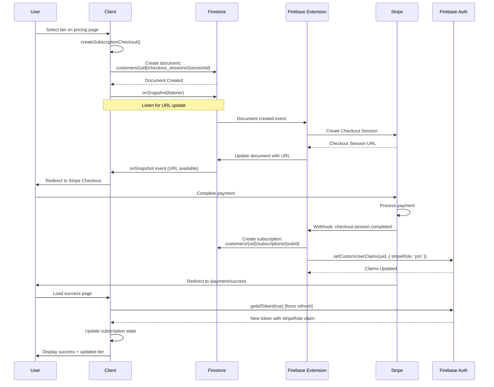
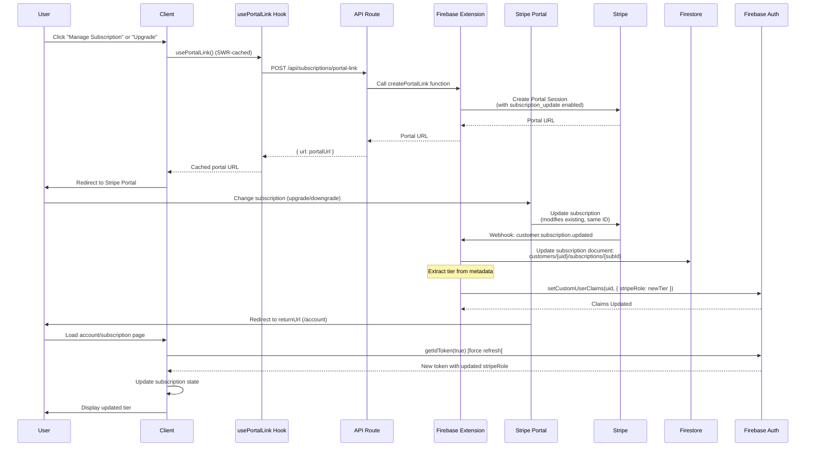
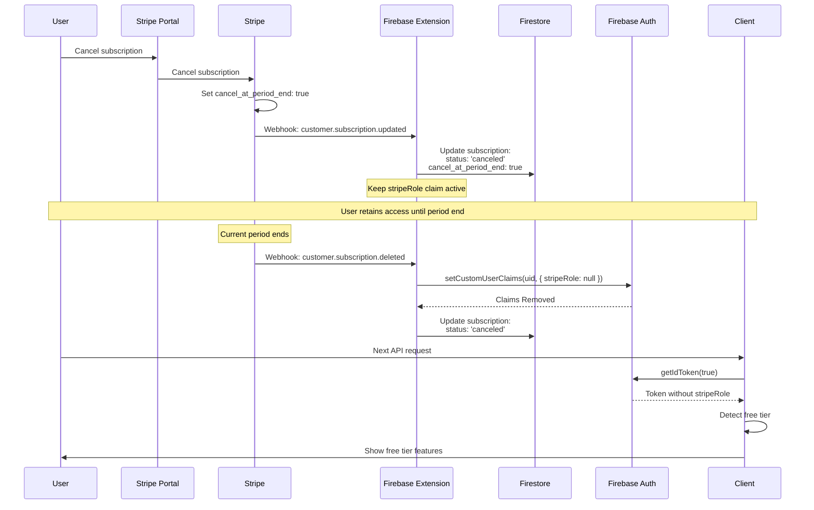
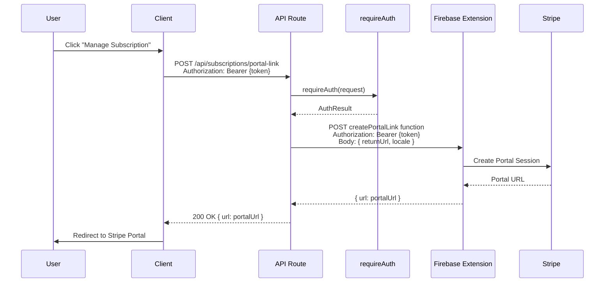

# Subscription System - Domain Architecture

## Overview

YourApp's subscription system is a fully automated, Firebase Stripe Extension-powered subscription management system that handles recurring billing, tier management, and access control through Firebase custom claims.

**Key Characteristics:**
- **Storage:** Subscriptions stored in Firestore (not Prisma/PostgreSQL)
- **Automation:** Firebase Stripe Extension handles all subscription lifecycle events
- **Access Control:** Firebase custom claims (`stripeRole`) for tier-based access
- **Billing:** Recurring monthly/annual subscriptions with optional trial periods
- **Management:** Stripe Customer Portal for user self-service

**Architecture Separation:**
- **Subscriptions** → Firestore (recurring billing, managed by Firebase Extension)
- **Orders** → Prisma/PostgreSQL (one-time purchases, manual creation)

---

## Table of Contents

1. [Architecture Overview](#architecture-overview)
2. [Subscription Tiers](#subscription-tiers)
3. [Subscription Lifecycle](#subscription-lifecycle)
4. [Firebase Stripe Extension Integration](#firebase-stripe-extension-integration)
5. [API Endpoints](#api-endpoints)
6. [Client-Side Integration](#client-side-integration)
7. [Access Control & Custom Claims](#access-control--custom-claims)
8. [Usage Tracking](#usage-tracking)
9. [Admin Management](#admin-management)
10. [Troubleshooting](#troubleshooting)

---

## Architecture Overview

### Data Storage

```
┌─────────────────────────────────────────────────────────────┐
│                    Subscription System                       │
├─────────────────────────────────────────────────────────────┤
│                                                              │
│  FIRESTORE (Firebase)                                        │
│  ┌────────────────────────────────────────────────────┐     │
│  │ customers/{firebaseUid}/                          │     │
│  │   ├─ checkout_sessions/{sessionId}               │     │
│  │   └─ subscriptions/{subscriptionId}              │     │
│  └────────────────────────────────────────────────────┘     │
│                                                              │
│  FIREBASE AUTH (Custom Claims)                              │
│  ┌────────────────────────────────────────────────────┐     │
│  │ stripeRole: 'basic' | 'pro' | 'enterprise'         │     │
│  └────────────────────────────────────────────────────┘     │
│                                                              │
│  PRISMA/PostgreSQL (Usage Tracking)                         │
│  ┌────────────────────────────────────────────────────┐     │
│  │ CalculatorUsage (monthly calculation counts)      │     │
│  └────────────────────────────────────────────────────┘     │
└─────────────────────────────────────────────────────────────┘
```

### System Flow

```
User Action → Client Component → API/Firestore → Firebase Extension → Stripe
                                                      ↓
                                              Firestore Update
                                                      ↓
                                              Custom Claims Update
                                                      ↓
                                              Client Token Refresh
```

---

## Subscription Tiers

### Tier Hierarchy

```
Enterprise ($99/mo) - Unlimited calculations, all features
    ↑
  Pro ($29/mo) - 500 calculations/month, premium calculators
    ↑
 Basic ($9/mo) - 50 calculations/month, loan calculator
    ↑
 Free - Mortgage calculator only (unlimited)
```

### Tier Configuration

**Location:** `shared/constants/subscription.constants.ts`

```typescript
export const SUBSCRIPTION_TIERS = {
  BASIC: "basic",
  PRO: "pro",
  ENTERPRISE: "enterprise",
} as const;

export type SubscriptionTier = 
  (typeof SUBSCRIPTION_TIERS)[keyof typeof SUBSCRIPTION_TIERS];
```

### Tier Features

**Location:** `shared/constants/subscription.constants.ts`

```typescript
const BASE_TIER_FEATURES: Record<SubscriptionTier, SubscriptionTierFeatures> = {
  basic: {
    maxCalculationsPerMonth: 50,
    calculationTypes: ["loan"],
    exportFormats: ["pdf"],
    supportLevel: "email",
    apiAccess: false,
    customBranding: false,
  },
  pro: {
    maxCalculationsPerMonth: 500,
    calculationTypes: ["loan", "investment"],
    exportFormats: ["pdf", "excel", "csv"],
    supportLevel: "priority",
    apiAccess: true,
    customBranding: false,
  },
  enterprise: {
    maxCalculationsPerMonth: -1, // unlimited
    calculationTypes: ["loan", "investment", "retirement", "custom"],
    exportFormats: ["pdf", "excel", "csv", "api"],
    supportLevel: "dedicated",
    apiAccess: true,
    customBranding: true,
  },
};
```

### Stripe Price Configuration

**Location:** `shared/constants/stripe.constants.ts`

```typescript
export const STRIPE_MAP: StripeMap = {
  tiers: {
    basic: {
      productId: "prod_TWTXj1UeJcW6vz",
      prices: {
        monthly: {
          priceId: "price_1SZQa63qLZiOfTxsQZkBift7",
          amount: 10.0,
        },
        annual: {
          priceId: "price_1SZQak3qLZiOfTxsM7kwhZwQ",
          amount: 100.0,
        },
      },
    },
    // ... pro and enterprise tiers
  },
};
```

---

## Subscription Lifecycle

### 1. Subscription Creation (Checkout Flow)

**Preferred Method:** Client-side Firestore + onSnapshot (real-time)

**Location:** `features/payments/services/stripe-checkout.ts`

```typescript
// Client-side checkout creation
export async function createSubscriptionCheckout(
  userId: string,
  priceId: string,
  options: Partial<CheckoutSessionData> = {}
): Promise<CheckoutResult> {
  const sessionData = {
    mode: "subscription",
    price: priceId, // Firebase Extension expects 'price' field
    success_url: options.success_url || `${window.location.origin}/payment/success`,
    cancel_url: options.cancel_url || `${window.location.origin}/payment/cancel`,
    trial_period_days: options.trial_period_days,
    metadata: {
      userId,
      tier: tier,
      billingCycle: billingCycle,
    },
  };

  // Create Firestore document
  const docRef = await addDoc(
    collection(db, "customers", userId, "checkout_sessions"),
    sessionData
  );

  // Listen for Firebase Extension to populate URL
  return new Promise((resolve) => {
    const unsubscribe = onSnapshot(docRef, (snap) => {
      const data = snap.data();
      if (data?.url) {
        unsubscribe();
        resolve({ url: data.url });
      }
      if (data?.error) {
        unsubscribe();
        resolve({ error: new Error(data.error.message) });
      }
    });
  });
}
```

**Flow:**



**Steps:**
1. User selects tier on pricing page
2. Client calls createSubscriptionCheckout()
3. Client creates Firestore document: customers/{uid}/checkout_sessions/{sessionId}
4. Client listens to document via onSnapshot
5. Firebase Extension detects new document
6. Extension creates Stripe Checkout session
7. Extension updates Firestore document with checkout URL
8. Client receives URL via onSnapshot and redirects user
9. User completes payment on Stripe
10. Stripe webhook → Firebase Extension
11. Extension creates subscription in Firestore: customers/{uid}/subscriptions/{subId}
12. Extension sets custom claim: stripeRole='pro'
13. User redirected to /payment/success
14. Client forces token refresh: user.getIdToken(true)

### 2. Subscription Status

**Status Types:**
- `active` - Subscription is active and billing
- `trialing` - In trial period
- `canceled` - Canceled but may still have access until period end
- `past_due` - Payment failed, retrying
- `incomplete` - Initial payment failed
- `incomplete_expired` - Payment attempt expired

**Location:** `shared/constants/subscription.constants.ts`

```typescript
export type SubscriptionStatus =
  | "active"
  | "canceled"
  | "past_due"
  | "trialing"
  | "incomplete"
  | "incomplete_expired";
```

### 3. Subscription Updates (Upgrade/Downgrade)

**Important:** As of January 2026, ALL subscription plan changes must go through the Stripe Customer Portal. The pricing page and checkout flow are only for creating NEW subscriptions. Users with existing subscriptions cannot use checkout to change plans.

**Flow via Stripe Customer Portal:**



**Steps:**
1. User clicks "Manage Subscription" or any "Upgrade" button
2. Client uses `usePortalLink()` hook (SWR automatically caches the link)
3. Hook calls `/api/subscriptions/portal-link` (POST) if not cached
4. API calls Firebase Extension `createPortalLink` function
5. Extension returns Stripe Customer Portal URL (with subscription updates enabled)
6. User changes subscription on Stripe portal
7. Stripe modifies the existing subscription (same subscription ID)
8. Stripe webhook → Firebase Extension
9. Extension updates Firestore subscription document
10. Extension updates custom claim (stripeRole)
11. User redirected back to `/account`
12. User refreshes token to see new tier

**Key Architecture Points:**
- **Pricing page is for NEW subscriptions only** - Users without subscriptions use checkout
- **All plan changes go through portal** - Users with subscriptions must use portal
- **Checkout is protected** - Validates no existing subscription before allowing checkout
- **Portal link is cached** - SWR automatically caches portal links for 5 minutes
- **No upgrade/downgrade logic in pricing components** - All routing is subscription-aware

**Location:** `app/api/subscriptions/portal-link/route.ts`

```typescript
export async function POST(request: NextRequest) {
  const authResult = await requireAuth(request);
  
  // Call Firebase Extension function
  const functionUrl = `https://${region}-${projectId}.cloudfunctions.net/ext-firestore-stripe-payments-createPortalLink`;
  
  const response = await fetch(functionUrl, {
    method: "POST",
    headers: {
      "Content-Type": "application/json",
      Authorization: `Bearer ${token}`,
    },
    body: JSON.stringify({
      data: {
        returnUrl: `${baseUrl}/account`,
        locale: "auto",
        // Enable subscription updates to allow plan switching
        features: {
          subscription_update: {
            enabled: true,
            default_allowed_updates: ["price"], // Allow price/tier changes
            proration_behavior: "none", // No proration during trial
          },
        },
      },
    }),
  });
  
  const result = await response.json();
  return createSuccessResponse({ url: result.data?.url || result.url });
}
```

**Client-Side Hook:** `shared/hooks/use-portal-link.ts`

```typescript
export function usePortalLink() {
  const { user } = useApp();
  const key = user ? "/api/subscriptions/portal-link" : null;
  
  const fetcher = async (): Promise<string> => {
    const response = await authenticatedFetchJson<PortalLinkResponse>(
      "/api/subscriptions/portal-link",
      { method: "POST" }
    );
    return response.url;
  };
  
  const { data: portalUrl, error, isLoading, mutate } = useSWR(
    key,
    fetcher,
    {
      revalidateOnFocus: false,
      revalidateOnReconnect: false,
      dedupingInterval: 300000, // 5 minutes
      revalidateIfStale: false,
    }
  );
  
  return { portalUrl, isLoading, error, refresh: mutate };
}
```

### 4. Subscription Cancellation

**Flow:**



**Steps:**
1. User cancels via Stripe Customer Portal
2. Stripe webhook → Firebase Extension
3. Extension updates subscription status to 'canceled'
4. Extension sets cancel_at_period_end: true
5. User retains access until current_period_end
6. At period end, Extension removes custom claim (stripeRole)
7. User reverts to free tier

**Important:** Users keep access until the current billing period ends, even after cancellation.

---

## Firebase Stripe Extension Integration

### Extension Responsibilities

The Firebase Stripe Extension (`ext-firestore-stripe-payments`) handles:

1. **Checkout Session Creation**
   - Monitors `customers/{uid}/checkout_sessions` collection
   - Creates Stripe Checkout sessions
   - Updates Firestore documents with checkout URLs

2. **Subscription Management**
   - Creates subscriptions in Firestore when checkout completes
   - Updates subscription status on webhook events
   - Manages subscription lifecycle (renewals, cancellations, failures)

3. **Custom Claims Management**
   - Sets `stripeRole` custom claim based on subscription tier
   - Updates claims when subscription changes
   - Removes claims when subscription ends

4. **Webhook Processing**
   - Processes Stripe webhooks automatically
   - Updates Firestore documents in real-time
   - Handles payment failures and retries

### Firestore Document Structure

**Checkout Session:**
```
customers/{firebaseUid}/checkout_sessions/{sessionId}
{
  price: "price_xxx",
  mode: "subscription",
  success_url: "...",
  cancel_url: "...",
  metadata: {
    userId: "...",
    tier: "pro",
    billingCycle: "monthly"
  },
  url: "https://checkout.stripe.com/..." // Populated by Extension
}
```

**Subscription:**
```
customers/{firebaseUid}/subscriptions/{subscriptionId}
{
  id: "sub_xxx",
  status: "active",
  customer: "cus_xxx",
  current_period_start: 1234567890,
  current_period_end: 1234567890,
  items: {
    data: [{
      price: {
        id: "price_xxx",
        interval: "month"
      }
    }]
  },
  metadata: {
    tier: "pro",
    billingCycle: "monthly"
  }
}
```

### Extension Configuration

The Extension is configured to:
- Monitor `customers/{uid}/checkout_sessions` for new sessions
- Create subscriptions in `customers/{uid}/subscriptions`
- Set custom claims based on subscription tier from metadata
- Process all Stripe webhook events automatically

---

## API Endpoints

### Customer Endpoints

#### GET `/api/subscriptions/current`

Get current user's subscription details.

**Location:** `app/api/subscriptions/current/route.ts`

```typescript
export async function GET(request: NextRequest) {
  const authResult = await requireAuth(request);
  
  const db = getFirestore();
  const subscriptionsRef = db
    .collection("customers")
    .doc(user.firebaseUid)
    .collection("subscriptions");
  
  // Get active subscriptions
  const subscriptionsSnapshot = await subscriptionsRef
    .where("status", "in", ["active", "trialing"])
    .get();
  
  if (subscriptionsSnapshot.empty) {
    return createSuccessResponse({
      subscription: null,
      tier: null,
      billingCycle: null,
    });
  }
  
  const subscriptionDoc = subscriptionsSnapshot.docs[0];
  const subData = subscriptionDoc.data();
  
  // Extract tier from metadata
  const tier = subData.metadata?.tier || "basic";
  
  // Determine billing cycle
  const billingCycle = subData.metadata?.billingCycle || 
    (subData.items?.data?.[0]?.price?.interval === "month" ? "monthly" : "annual");
  
  return createSuccessResponse({
    subscription: {
      id: subscriptionDoc.id,
      tier,
      billingCycle,
      status: subData.status,
      currentPeriodStart: subData.current_period_start,
      currentPeriodEnd: subData.current_period_end,
    },
    tier,
    billingCycle,
  });
}
```

**Response:**
```json
{
  "data": {
    "subscription": {
      "id": "sub_xxx",
      "tier": "pro",
      "billingCycle": "monthly",
      "status": "active",
      "currentPeriodStart": "2026-01-01T00:00:00Z",
      "currentPeriodEnd": "2026-02-01T00:00:00Z"
    },
    "tier": "pro",
    "billingCycle": "monthly"
  }
}
```

#### POST `/api/subscriptions/portal-link`

Create Stripe Customer Portal link for subscription management.

**Location:** `app/api/subscriptions/portal-link/route.ts`

**Flow:**



**Request Body:**
```json
{
  "returnUrl": "https://app.example.com/account/subscription"
}
```

**Response:**
```json
{
  "data": {
    "url": "https://billing.stripe.com/p/session/xxx"
  }
}
```

### Admin Endpoints

#### GET `/api/admin/subscriptions`

List all subscriptions with filtering and pagination.

**Location:** `app/api/admin/subscriptions/route.ts`

**Query Parameters:**
- `page` - Page number (default: 1)
- `limit` - Items per page (default: 50)
- `status` - Filter by status (active, canceled, etc.)
- `tier` - Filter by tier (basic, pro, enterprise)
- `search` - Search by user ID, email, or Stripe IDs

**Response:**
```json
{
  "data": {
    "subscriptions": [
      {
        "id": "sub_xxx",
        "userId": "firebase_uid",
        "user": {
          "id": "db_uuid",
          "name": "John Doe",
          "email": "john@example.com"
        },
        "tier": "pro",
        "status": "active",
        "stripeCustomerId": "cus_xxx",
        "stripeSubscriptionId": "sub_xxx",
        "usageCount": 23,
        "usageLimit": 500,
        "currentPeriodStart": "2026-01-01T00:00:00Z",
        "currentPeriodEnd": "2026-02-01T00:00:00Z",
        "createdAt": "2025-12-01T00:00:00Z",
        "updatedAt": "2026-01-15T00:00:00Z"
      }
    ],
    "pagination": {
      "page": 1,
      "limit": 50,
      "total": 150,
      "totalPages": 3,
      "hasMore": true
    }
  }
}
```

---

## Client-Side Integration

### Subscription Hook

**Location:** `features/subscriptions/hooks/use-subscription.ts`

```typescript
export function useSubscription(): SubscriptionAccess {
  const [role, setRole] = useState<SubscriptionRole>(null);
  const [isLoading, setIsLoading] = useState(true);
  
  useEffect(() => {
    const checkSubscription = async () => {
      const user = auth.currentUser;
      if (!user) {
        setRole(null);
        setIsLoading(false);
        return;
      }
      
      // Force refresh to get latest custom claims
      await user.getIdToken(true);
      const tokenResult = await user.getIdTokenResult();
      const stripeRole = tokenResult.claims.stripeRole as string | undefined;
      
      setRole((stripeRole as SubscriptionRole) || null);
      setIsLoading(false);
    };
    
    checkSubscription();
    
    // Listen for auth state changes
    const unsubscribe = auth.onAuthStateChanged(() => {
      checkSubscription();
    });
    
    return () => unsubscribe();
  }, []);
  
  return {
    role,
    hasBasicAccess: role === "basic" || role === "pro" || role === "enterprise",
    hasProAccess: role === "pro" || role === "enterprise",
    hasEnterpriseAccess: role === "enterprise",
    isLoading,
    error: null,
  };
}
```

**Usage:**
```typescript
function MyComponent() {
  const { role, hasProAccess, isLoading } = useSubscription();
  
  if (isLoading) return <Loading />;
  
  if (!hasProAccess) {
    return <UpgradePrompt requiredTier="pro" />;
  }
  
  return <ProFeature />;
}
```

### Subscription Checkout Component

**Location:** `features/payments/components/checkout/subscription-checkout.tsx`

**Important:** Checkout is protected - it validates that the user does NOT have an existing subscription before allowing checkout.

```typescript
export function SubscriptionCheckout({
  tier,
  billingCycle,
  onBillingCycleChange,
}: SubscriptionCheckoutProps) {
  const { user } = useApp();
  const [isProcessing, setIsProcessing] = useState(false);
  
  const handleCheckout = async () => {
    setIsProcessing(true);
    
    // Check if user already has an active subscription
    const subscriptionCheck = await fetch("/api/subscriptions/current");
    if (subscriptionCheck.ok) {
      const subData = await subscriptionCheck.json();
      if (subData.data?.tier) {
        setError(t("checkout_existing_subscription_error"));
        setIsProcessing(false);
        return;
      }
    }
    
    const tierConfig = getTierConfig(tier, billingCycle);
    const trialDays = parseInt(
      process.env.NEXT_PUBLIC_SUBSCRIPTION_TRIAL_DAYS || "14"
    );
    
    const result = await createSubscriptionCheckout(
      user.uid,
      tierConfig.stripePriceId,
      {
        success_url: `${baseUrl}/payment/success?type=subscription`,
        cancel_url: `${baseUrl}/payment/cancel`,
        trial_period_days: trialDays > 0 ? trialDays : undefined,
        metadata: {
          userId: user.uid,
          tier: tier,
          billingCycle: billingCycle,
        },
      }
    );
    
    if (result.url) {
      window.location.href = result.url;
    } else if (result.error) {
      setError(result.error.message);
    }
  };
  
  return (
    <button onClick={handleCheckout} disabled={isProcessing}>
      {isProcessing ? "Processing..." : `Subscribe to ${tier}`}
    </button>
  );
}
```

**Protection:** Both `checkout-interactive.tsx` and `subscription-checkout.tsx` check for existing subscriptions and redirect users to `/account` with a message to use the portal if they already have a subscription.

### Feature Gate Component

**Location:** `features/subscriptions/components/feature-gate.tsx`

```typescript
export function FeatureGate({
  requiredTier,
  children,
  fallback,
}: FeatureGateProps) {
  const { role, isLoading } = useSubscription();
  
  if (isLoading) return <Loading />;
  
  const hasAccess = useHasTierAccess(requiredTier);
  
  if (!hasAccess) {
    return fallback || <UpgradePrompt requiredTier={requiredTier} />;
  }
  
  return <>{children}</>;
}
```

**Usage:**
```typescript
<FeatureGate requiredTier="pro" fallback={<UpgradePrompt />}>
  <InvestmentCalculator />
</FeatureGate>
```

---

## Access Control & Custom Claims

### Custom Claims

Firebase custom claims are used for fast, client-side access control:

**Claim Name:** `stripeRole`

**Values:**
- `"basic"` - Basic tier subscription
- `"pro"` - Pro tier subscription
- `"enterprise"` - Enterprise tier subscription
- `undefined` - No subscription (free tier)

### Claim Management

**Set by:** Firebase Stripe Extension automatically

**When Updated:**
- Subscription created → Claim set to tier
- Subscription upgraded → Claim updated to new tier
- Subscription downgraded → Claim updated to new tier
- Subscription canceled → Claim removed at period end
- Subscription expired → Claim removed

### Reading Claims

**Client-Side:**
```typescript
const user = auth.currentUser;
await user.getIdToken(true); // Force refresh
const tokenResult = await user.getIdTokenResult();
const stripeRole = tokenResult.claims.stripeRole;
```

**Server-Side:**
```typescript
const decodedToken = await adminAuth.verifyIdToken(token);
const stripeRole = decodedToken.role; // Note: 'role' not 'stripeRole' in decoded token
```

### Access Control Pattern

**Hierarchical Access:**
```typescript
// Check if user has access to a tier
function hasTierAccess(
  userTier: SubscriptionTier | null,
  requiredTier: SubscriptionTier
): boolean {
  if (!userTier) return false;
  
  const tierOrder = { basic: 1, pro: 2, enterprise: 3 };
  return tierOrder[userTier] >= tierOrder[requiredTier];
}
```

**Calculator Access:**
```typescript
// Check calculator access
export function hasCalculatorAccess(
  userTier: SubscriptionTier | null,
  calculatorType: CalculationType
): boolean {
  const required = CALCULATOR_TIER_REQUIREMENTS[calculatorType];
  
  // Free calculator
  if (required === null) return true;
  
  // No subscription
  if (!userTier) return false;
  
  // Check tier hierarchy
  const tierOrder = { basic: 1, pro: 2, enterprise: 3 };
  return tierOrder[userTier] >= tierOrder[required];
}
```

---

## Usage Tracking

### Usage Limits

**Monthly Calculation Limits:**
- **Free:** Unlimited (for free calculators only)
- **Basic:** 50 calculations/month
- **Pro:** 500 calculations/month
- **Enterprise:** Unlimited

### Usage Storage

**Location:** Prisma/PostgreSQL `CalculatorUsage` table

```prisma
model CalculatorUsage {
  id              String   @id @default(uuid())
  userId          String
  calculationType String   // "mortgage", "loan", "investment", "retirement"
  inputData       Json
  resultData      Json
  calculationTime Int      // milliseconds
  createdAt       DateTime @default(now())
  
  @@index([userId, createdAt])
}
```

### Usage Tracking Flow

```
1. User submits calculation
2. Check: Does user have access to calculator type?
3. Check: Has user reached monthly limit? (for paid calculators)
4. Perform calculation
5. Save to CalculatorUsage table (only for gated calculators)
6. Return result + updated usage stats
```

### Usage Statistics

**API:** `/api/calculator/usage` (GET)

**Response:**
```json
{
  "data": {
    "currentUsage": 23,
    "usageLimit": 50,
    "percentageUsed": 46,
    "resetDate": "2026-02-01T00:00:00Z",
    "isLimitReached": false
  }
}
```

**Calculation:**
- Count `CalculatorUsage` records for current month
- Exclude free calculators (mortgage)
- Compare against tier limit
- Reset on 1st of each month

---

## Admin Management

### Admin Subscription View

**Location:** `app/admin/subscriptions/page.tsx`

**Features:**
- List all subscriptions with pagination
- Filter by status, tier, search
- View subscription details
- See usage statistics per subscription
- Link to Stripe dashboard

### Subscription Analytics

**Location:** `app/api/admin/subscriptions/analytics/route.ts`

**Metrics:**
- Total active subscriptions
- MRR (Monthly Recurring Revenue)
- ARPU (Average Revenue Per User)
- Churn rate
- Conversion rate (free → paid)
- Tier distribution

### Admin Actions

**Available via Stripe Dashboard:**
- View subscription details
- Cancel subscriptions
- Issue refunds
- Update billing information
- View payment history

**Note:** Most subscription management is done through Stripe Customer Portal (user self-service) or Stripe Dashboard (admin).

---

## Troubleshooting

### Common Issues

#### 1. Custom Claim Not Set

**Symptom:** User has subscription but `stripeRole` claim is missing.

**Causes:**
- Firebase Extension not configured correctly
- Subscription metadata missing `tier` field
- Extension webhook processing delayed

**Solution:**
- Check Firestore subscription document has `metadata.tier`
- Verify Firebase Extension is running
- Force token refresh: `user.getIdToken(true)`
- Check Extension logs in Firebase Console

#### 2. Subscription Not Appearing in Firestore

**Symptom:** Payment completed but no subscription document created.

**Causes:**
- Firebase Extension not processing webhooks
- Webhook endpoint not configured in Stripe
- Extension configuration error

**Solution:**
- Check Stripe webhook events in Stripe Dashboard
- Verify webhook endpoint in Firebase Extension config
- Check Extension logs for errors
- Manually trigger webhook if needed

#### 3. Trial Period Not Applied

**Symptom:** Subscription starts immediately without trial.

**Causes:**
- `trial_period_days` not set in checkout session
- Stripe product doesn't support trials
- Extension not processing trial metadata

**Solution:**
- Verify `trial_period_days` in checkout session data
- Check Stripe product configuration
- Ensure Extension is processing trial metadata

#### 4. Portal Link Creation Fails

**Symptom:** Error when creating Stripe Customer Portal link.

**Causes:**
- Firebase Extension function not deployed
- Incorrect function URL
- Authentication token invalid

**Solution:**
- Verify Extension function is deployed
- Check function URL matches project configuration
- Ensure user is authenticated with valid token
- Check Extension logs for detailed error

### Debugging Tools

**Firebase Console:**
- Firestore data browser
- Extension logs
- Authentication custom claims viewer

**Stripe Dashboard:**
- Subscription details
- Webhook event logs
- Payment history
- Customer portal links

**Application Logs:**
- Check `debugLog` output for subscription operations
- Monitor API route logs
- Check client-side console for errors

---

## Related Documentation

- [Subscription Portal-Only Refactor Plan](../plantofix/subscription-portal-only-refactor.md) - Complete refactor documentation
- [Subscription Upgrade/Downgrade Flow](../troubleshooting/subscription-upgrade-downgrade-flow.md) - Detailed flow explanation
- [Business Model](./business-model.md) - Subscription tiers, pricing, features
- [Calculator System](./calculator-system.md) - Calculator access rules
- [Account Management](./account-management.md) - User subscription management
- [Admin Dashboard](./admin-dashboard.md) - Admin subscription management
- [Authentication](../core/authentication.md) - Custom claims and access control

---

*Last Updated: January 2026 - Updated to reflect portal-only architecture for plan changes*
